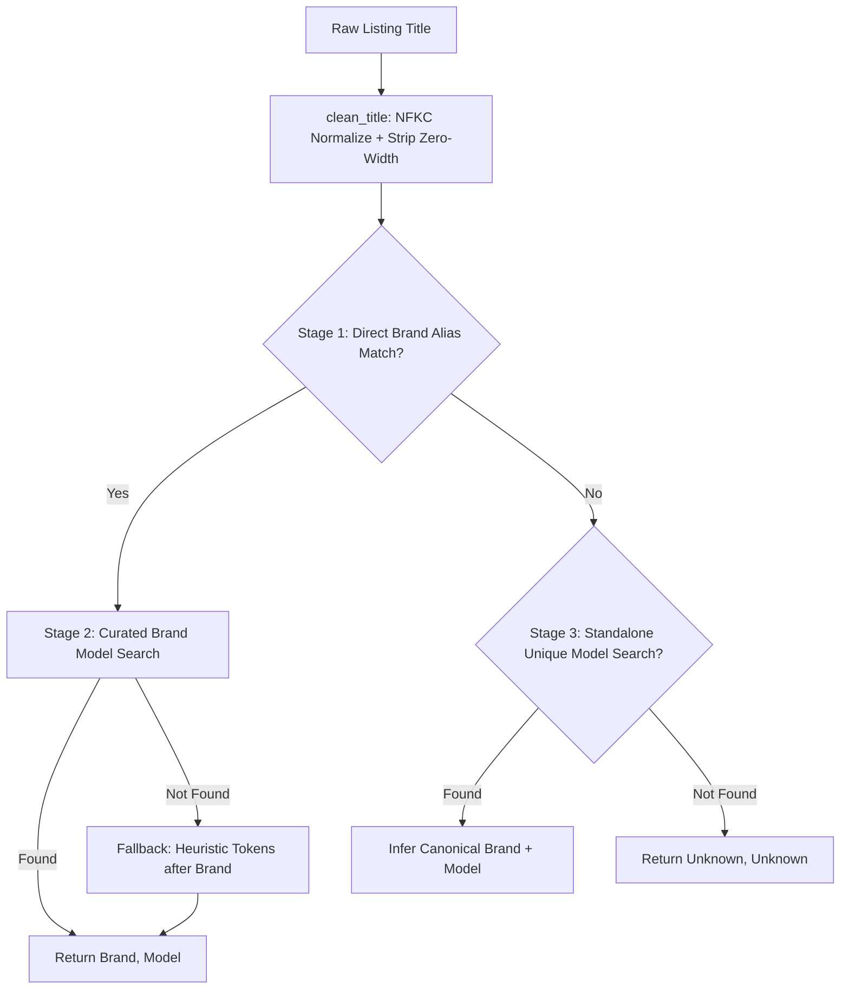

# 🚗 Cambodia Car Price Prediction & Market Intelligence Engine

[](https://github.com/PHALMenghak/car-price-prediction/actions/workflows/run_tests.yml)
[](https://github.com/PHALMenghak/car-price-prediction/actions/workflows/daily_scraper.yml)
[](https://www.python.org/downloads/)
[](https://github.com/astral-sh/uv)
[](https://docs.pytest.org/)
[](https://github.com/psf/black)
[](LICENSE)

> **End-to-End MLOps & Data Science System for Second-Hand Vehicle Valuation in Cambodia**  
> An automated, production-grade machine learning platform that captures real-time automotive market feeds from **Khmer24**, resolves complex multilingual titles (Khmer, English, Chinese), engineers market-specific features via a **Medallion Data Architecture (Bronze → Silver → Gold)**, and trains high-precision car valuation models.

---

## 📌 Table of Contents

- [Executive Summary](#-executive-summary)
- [System Architecture](#-system-architecture)
- [Data Pipeline & Medallion Architecture](#-data-pipeline--medallion-architecture)
- [Multilingual NLP & Brand Extraction Engine](#-multilingual-nlp--brand-extraction-engine)
- [Current Market Dataset & Quality Metrics](#-current-market-dataset--quality-metrics)
- [Repository Structure](#-repository-structure)
- [Getting Started](#-getting-started)
  - [Prerequisites](#prerequisites)
  - [Installation](#installation)
  - [Environment Configuration](#environment-configuration)
- [Pipeline Execution](#-pipeline-execution)
  - [1. Data Ingestion (Extract & Load)](#1-data-ingestion-extract--load)
  - [2. Data Transformation & Feature Engineering](#2-data-transformation--feature-engineering)
  - [3. Running Test Suite](#3-running-test-suite)
- [CI/CD & Cloud Infrastructure](#-cicd--cloud-infrastructure)
- [Project Roadmap](#-project-roadmap)
- [Author & Internship Info](#-author--internship-info)

---

## 🌟 Executive Summary

Cambodia’s automotive secondary market is fast-growing but characterized by:
1. **High Pricing Asymmetry**: Unstandardized dealer vs. private listing prices.
2. **Multilingual & Unstructured Listings**: Titles mixed in Khmer (`ឡានលក់ Prius 07`), Chinese (`腾势D9`, `全新GN8`), and English nicknames (`ស្រីម៉ៅ` $\rightarrow$ Lexus RX300).
3. **Missing Structured Specs**: Odometer, fuel type, and engine size are frequently buried in free-text titles and description bodies.

This project delivers an automated pipeline that **continuously collects, validates, cleans, enriches, and models car prices**, providing buyers, sellers, and financial institutions with accurate market valuations.

---

## 🏗️ System Architecture

```
 ┌─────────────────────────────────────────────────────────────────────────────────────────┐
 │                                   DATA INGESTION LAYER                                  │
 │                                                                                         │
 │   ┌─────────────────┐       ┌────────────────────────┐       ┌──────────────────────┐   │
 │   │  Khmer24 Core   │ ────▶ │ Cloudflare Relay Worker│ ────▶ │  Khmer24Client       │   │
 │   │  & Posts API    │       │ (IP Bypassing Bridge)  │       │  (TLS Impersonation) │   │
 │   └─────────────────┘       └────────────────────────┘       └──────────┬───────────┘   │
 └─────────────────────────────────────────────────────────────────────────┼───────────────┘
                                                                           ▼
 ┌─────────────────────────────────────────────────────────────────────────────────────────┐
 │                                MEDALLION DATA PIPELINE                                  │
 │                                                                                         │
 │   ┌───────────────────────────┐   Pydantic v2      ┌────────────────────────────────┐   │
 │   │  BRONZE LAYER (Raw)       │ ─────────────────▶ │  Daily Parquet Snapshots       │   │
 │   │  data/raw/cars_*.parquet  │                    │  (cars_YYYY-MM-DD.parquet)     │   │
 │   └─────────────┬─────────────┘                    └────────────────────────────────┘   │
 │                 ▼                                                                       │
 │   ┌───────────────────────────┐   Sanity Filters   ┌────────────────────────────────┐   │
 │   │  SILVER LAYER (Cleaned)   │ ─────────────────▶ │  Multilingual Brand Extraction │   │
 │   │  Time-Series Deduplication│                    │  Snapshot Change Tracking      │   │
 │   └─────────────┬─────────────┘                    └────────────────────────────────┘   │
 │                 ▼                                                                       │
 │   ┌───────────────────────────┐   Feature Eng.     ┌────────────────────────────────┐   │
 │   │  GOLD LAYER (ML Features) │ ─────────────────▶ │  data/processed/cars_train     │   │
 │   │  Depreciation & Log-Price │                    │  data/processed/cars_test      │   │
 │   └─────────────┬─────────────┘                    └────────────────────────────────┘   │
 └─────────────────┼───────────────────────────────────────────────────────────────────────┘
                   ▼
 ┌─────────────────────────────────────────────────────────────────────────────────────────┐
 │                               MODELING & SERVING LAYER                                  │
 │                                                                                         │
 │   ┌───────────────────────────┐                    ┌────────────────────────────────┐   │
 │   │  Model Training           │ ─────────────────▶ │  Serving & Inference API       │   │
 │   │  (XGBoost, RF, Ridge)     │                    │  (FastAPI REST /predict)       │   │
 │   └───────────────────────────┘                    └────────────────────────────────┘   │
 └─────────────────────────────────────────────────────────────────────────────────────────┘
```

---

## 💎 Data Pipeline & Medallion Architecture

The pipeline processes data following the industry **Medallion Architecture**:

### 🥉 Bronze Layer (Raw Storage)
- Stores raw, immutable daily snapshots (`data/raw/cars_YYYY-MM-DD.parquet`).
- Validated at ingest-time using **Pydantic v2** (`AdListingModel`), converting malformed inputs, currency symbols, and nested seller objects safely.
- Retains full un-parsed payload in `raw_specs` for future feature backfilling.

### 🥈 Silver Layer (Cleaned & Standardized)
- **Multi-Day Snapshot Tracking**: Matches listings across time to compute `days_on_market`, `price_drop_amount`, `has_price_drop`, and `view_velocity`.
- **Sanity Bounds Filtering**: Removes extreme anomalies ($Price < \$500$ or $> \$500,000$, $Year < 1980$ or $> 2027$).
- **Multilingual Brand Re-Extraction**: Re-evaluates all raw titles using compiled regex lookahead/lookbehind patterns.

### 🥇 Gold Layer (Machine Learning Feature Store)
- **Continuous Features**: `vehicle_age`, `vehicle_age_squared`, `log_price` ($\ln(Price + 1)$), `view_count`, `days_on_market`.
- **Market Categorical Signals**: `is_luxury_brand` (Lexus, Mercedes, BMW, Porsche, etc.), `is_popular_brand` (Toyota, Ford, etc.), `is_chinese_ev_brand` (BYD, GAC, Zeekr, Denza, Changan, etc.).
- **Geographic & Listing Flags**: `is_location_tier_1` (Phnom Penh), `is_location_tier_2`, `has_full_option`, `is_urgent_sale`.
- **Missing Value Imputation**: Median-imputed odometer with `is_mileage_missing` binary indicator.

---

## 🗣️ Multilingual NLP & Brand Extraction Engine

Khmer24 car titles feature mixed scripts, spelling variations, and slang. The custom extraction engine ([`src/parsers.py`](file:///D:/ITC3_AMS_2025/I4_AMS_S2/Y4_Internship/Car_price_prediction/src/parsers.py)) resolves these using a 3-stage fallback architecture:



### Supported Multilingual Formats:
* **Khmer Script**: `ឡាន Toyota Land Cruiser 2022` $\rightarrow$ `Toyota | Land Cruiser`
* **Local Nicknames**: `ឡានស្រីម៉ៅ 02` $\rightarrow$ `Lexus | RX300`
* **Chinese Characters**: `腾势D9` $\rightarrow$ `Denza | D9`, `全新GN8 宗师版` $\rightarrow$ `GAC | GN8`
* **Punctuation & Typos**: `Rang Rover LWB` $\rightarrow$ `Land Rover`, `NX.200T 015` $\rightarrow$ `Lexus | NX200t`, `LC_105series` $\rightarrow$ `Toyota | Land Cruiser`
* **Unicode Diacritics**: `2016 C-COUPÉ AMG` $\rightarrow$ `Mercedes-Benz | C-Class`

---

## 📊 Current Market Dataset & Quality Metrics

*(Audit metrics generated across 4 days of automated collection: August 17–20, 2026)*

| Metric | Value |
|---|---|
| **Total Cumulative Snapshots** | **1,925 listings** |
| **Unique Active Vehicles** | **1,559 listings** |
| **Valid Price Coverage** | **100.0%** |
| **Valid Model Year Coverage** | **100.0%** |
| **Brand Identification Rate** | **74.4%** (1,157 identified vehicles) |
| **Median Market Price** | **$23,900 USD** |
| **Average Market Price** | **$32,150 USD** |
| **Price Distribution Range** | **$600 to $258,000 USD** |
| **Median Vehicle Year** | **2015** (Average Age: 11.1 years) |

### Top 5 Brands in Cambodian Market (By Volume):
1. **Toyota** (24.4% market share) — *Prius, Camry, Highlander, Land Cruiser, Hilux Revo*
2. **Lexus** (9.2% market share) — *RX300/330/350/450h, LX570, NX200t, LM350h*
3. **Ford** (5.4% market share) — *Ranger Wildtrak, Raptor, Everest Titanium*
4. **Kia** (5.1% market share) — *Carnival, Morning, Sorento, K5*
5. **Mercedes-Benz** (3.3% market share) — *C-Class, E-Class, G63 AMG, S-Class*

---

## 📂 Repository Structure

```
Car_price_prediction/
├── .github/
│   └── workflows/
│       ├── daily_scraper.yml      # Automated daily scraping & git-push at 09:00 AM ICT
│       └── run_tests.yml          # Automated CI test suite on push and PR
├── cloudflare/
│   └── worker.js                  # Cloudflare Worker relay script (IP unblocking bridge)
├── data/
│   ├── raw/                       # Daily raw Parquet snapshots (cars_YYYY-MM-DD.parquet)
│   │   ├── cars_2026-08-17.parquet
│   │   ├── cars_2026-08-18.parquet
│   │   ├── cars_2026-08-19.parquet
│   │   ├── cars_2026-08-20.parquet
│   │   └── khmer24_cars_sample_60.csv
│   └── processed/                 # Silver & Gold datasets
│       ├── cars_train.parquet     # 80% ML training feature store (1,244 rows, 34 cols)
│       ├── cars_test.parquet      # 20% ML test feature store (311 rows, 34 cols)
│       └── preprocessing_manifest.json
├── logs/                          # Daily scraper execution logs (scraper_YYYY-MM-DD.log)
├── notebooks/                     # Exploratory Data Analysis & Modeling
│   ├── 01_data_collection.ipynb
│   ├── 02_eda_exploration.ipynb
│   ├── 03_baseline_models.ipynb
│   └── 04_model_evaluation.ipynb
├── pipeline/                      # Core Data Engineering Pipelines
│   ├── extract_load.py            # EL pipeline (feed scraper, change tracking)
│   └── transform.py               # Medallion data cleaning & feature engineering
├── src/                           # Shared Production Modules
│   ├── client.py                  # Khmer24 REST API client with retry & backoff
│   ├── parsers.py                 # Multilingual brand, model & spec extraction regexes
│   ├── schemas.py                 # Pydantic v2 data models & type validators
│   ├── storage.py                 # Parquet / CSV I/O, manifests & historical tracking
│   ├── cleaning.py                # Outlier detection & deduplication rules
│   └── config.py                  # Central settings, URLs & environment variables
├── tests/                         # Comprehensive Pytest Suite (81 tests)
│   ├── test_client.py
│   ├── test_parsers.py
│   ├── test_pipeline.py
│   ├── test_storage.py
│   └── test_transform.py
├── .env.example                   # Template for local environment variables
├── .gitignore                     # Optimized Git exclusion rules
├── pyproject.toml                 # Project metadata & Python dependencies
├── uv.lock                        # Deterministic, pinned package lockfile
├── ROADMAP.md                     # Complete 8-Phase Engineering Roadmap
└── README.md                      # Project documentation
```

---

## 🚀 Getting Started

### Prerequisites
* **Python 3.11+** installed
* **[uv](https://github.com/astral-sh/uv)** installed (Ultra-fast Python package installer & resolver)

### Installation

```bash
# 1. Clone the repository
git clone https://github.com/PHALMenghak/car-price-prediction.git
cd car-price-prediction

# 2. Create virtual environment and install all dependencies in <1 second
uv sync
```

### Environment Configuration

Create a `.env` file in the root directory:

```ini
KHMER24_DEVICE_ID=ds-intern-device-f4b8c10a
TARGET_CATEGORY=cars-for-sale
TARGET_PROVINCE=
MAX_PAGES=20
PYTHONUTF8=1

# Optional: Cloudflare Worker relay for GitHub Actions or restricted environments
POSTS_API_BASE=https://car-price-scraper.<your-worker>.workers.dev/
RELAY_KEY=your_secret_relay_key
ENRICH_DETAILS=false
```

---

## ⚡ Pipeline Execution

### 1. Data Ingestion (Extract & Load)
Scrapes active vehicle listings from Khmer24 and persists daily versioned Parquet files:

```bash
# Run with default settings (20 pages ~ 600 listings)
uv run python main.py

# Run with custom parameters
uv run python main.py --max-pages 50 --mode feed_window
```

### 2. Data Transformation & Feature Engineering
Applies deduplication, brand re-extraction, sanity bounds, and feature engineering to produce training sets:

```bash
uv run python pipeline/transform.py --test-size 0.2
```

Outputs:
* `data/processed/cars_train.parquet` (80% train split)
* `data/processed/cars_test.parquet` (20% test split)
* `data/processed/preprocessing_manifest.json`

### 3. Running Test Suite
Execute the comprehensive Pytest verification suite:

```bash
uv run pytest tests/ -v --tb=short
```

---

## ☁️ CI/CD & Cloud Infrastructure

### 🔄 GitHub Actions Daily Scraper ([`daily_scraper.yml`](file:///D:/ITC3_AMS_2025/I4_AMS_S2/Y4_Internship/Car_price_prediction/.github/workflows/daily_scraper.yml))
* **Schedule**: Triggers daily at `02:00 UTC` (`09:00 AM ICT`).
* **Workflow**: Sets up Python 3.11 with `uv`, tests Worker connectivity, executes `main.py`, commits new `data/raw/` and `logs/` files back to GitHub, and uploads 30-day artifacts.

### 🛡️ Cloudflare Worker Relay ([`cloudflare/worker.js`](file:///D:/ITC3_AMS_2025/I4_AMS_S2/Y4_Internship/Car_price_prediction/cloudflare/worker.js))
* Overcomes Cloudflare Bot Management on cloud runner IPs (e.g., Azure / GitHub Actions) by routing API calls securely through a trusted edge Worker proxy with `X-Relay-Key` authentication.

---

## 🗺️ Project Roadmap

| Phase | Milestone | Status |
|---|---|---|
| **Phase 1** | Automated Data Ingestion, Parquet Storage & Daily CI/CD | ✅ **Completed** (1,650+ cars) |
| **Phase 2** | Exploratory Data Analysis & Market Trend Discovery | 🔄 **In Progress** |
| **Phase 3** | Medallion Cleaning & Feature Engineering Pipeline | ✅ **Completed** (`pipeline/transform.py`) |
| **Phase 4** | Baseline & Ensemble Modeling (XGBoost, Random Forest) | 🔲 **Next Up** |
| **Phase 5** | Model Interpretability & Explainability (SHAP Values) | 🔲 Planned |
| **Phase 6** | Real-Time FastAPI Valuation Service (`/predict`) | 🔲 Planned |
| **Phase 7** | Automated Weekly Model Retraining & Drift Monitoring | 🔲 Planned |
| **Phase 8** | Interactive Dashboard (Streamlit / Next.js) | 🔲 Planned |

*See full step-by-step roadmap in [`ROADMAP.md`](file:///D:/ITC3_AMS_2025/I4_AMS_S2/Y4_Internship/Car_price_prediction/ROADMAP.md).*

---

## 👤 Author & Internship Info

* **Author**: **Phal Menghak**
* **Institution**: **Institute of Technology of Cambodia (ITC)**
* **Department**: Applied Mathematics and Statistics (AMS) — Year 4
* **Role**: Data Scientist & Machine Learning Engineer Intern
* **GitHub**: [@PHALMenghak](https://github.com/PHALMenghak)

---

## 📜 License

This project is licensed under the MIT License — see the [LICENSE](LICENSE) file for details.
