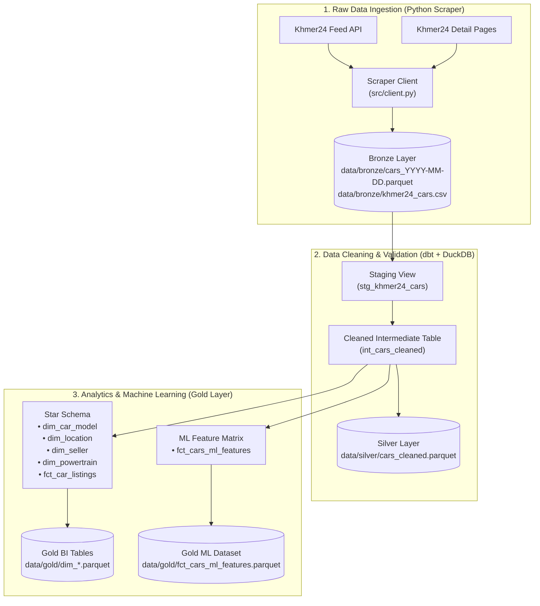

# 🚗 Cambodia Car Price Prediction & Market Intelligence

[](https://github.com/PHALMenghak/car-price-prediction/actions/workflows/run_tests.yml)
[](https://github.com/PHALMenghak/car-price-prediction/actions/workflows/daily_scraper.yml)
[](https://www.python.org/downloads/)
[](https://github.com/astral-sh/uv)
[](https://docs.getdbt.com/)
[](https://docs.pytest.org/)
[](https://docs.getdbt.com/)
[](LICENSE)

An automated data pipeline and machine learning project to predict used car prices and analyze automotive market trends in Cambodia.

The system automatically collects car listings from **Khmer24**, cleans multilingual text (Khmer, English, Chinese), standardizes vehicle specifications, and prepares clean datasets for machine learning models and analytics dashboards.

---

## 📌 Table of Contents

- [Project Overview](#-project-overview)
- [How It Works](#-how-it-works)
- [Data Architecture (Medallion Standard)](#-data-architecture-medallion-standard)
- [Repository Structure](#-repository-structure)
- [Quick Start](#-quick-start)
  - [Prerequisites](#prerequisites)
  - [Installation](#installation)
  - [Environment Setup](#environment-setup)
- [How to Run the Pipeline](#-how-to-run-the-pipeline)
  - [1. Scrape Raw Data](#1-scrape-raw-data)
  - [2. Inspect a Single Car Listing](#2-inspect-a-single-car-listing)
  - [3. Run Data Cleaning (dbt)](#3-run-data-cleaning-dbt)
  - [4. Run Automated Tests](#4-run-automated-tests)
- [Documentation & Data Dictionary](#-documentation--data-dictionary)
- [Project Roadmap](#-project-roadmap)
- [Author & Internship Information](#-author--internship-information)

---

## 🌟 Project Overview

In Cambodia, used car pricing can be difficult to predict because:
1. **Multilingual Listings**: Sellers write titles mixing Khmer (`ឡានលក់ Prius 07`), Chinese (`2026年海拉克斯`), and English (`Lexus Rx300 Full Option`).
2. **Missing Form Data**: Key details like model year, mileage, engine size, and tax status are often written inside the description or title rather than selected in dropdown forms.
3. **Price Variation**: Newly imported cars with "Tax Paper" (`ក្រដាសពន្ធ`) sell at a premium compared to registered "Plate Number" (`ផ្លាកលេខ`) cars.

### Our Solution
This project builds an automated **Extract-Load-Transform (ELT)** data pipeline:
* **Extract & Load**: Collects 100% of raw listing data without data loss.
* **Transform**: Uses **dbt** and **DuckDB** to clean, validate, and normalize the data.
* **Feature Store**: Prepares an analytical Star Schema and a Machine Learning feature matrix for price prediction models.

---

## 🔄 How It Works



---

## 💎 Data Architecture (Medallion Standard)

| Layer | Storage Location | Description |
| :--- | :--- | :--- |
| **🥉 Bronze (Raw)** | `data/bronze/` | Immutable, untouched raw listings collected daily from Khmer24. Preserves 35 standard attributes. |
| **🥈 Silver (Cleaned)** | `data/silver/` | Deduplicated and conformed records. Fixes brand/model names, normalizes colors/fuels, and enforces valid price bounds ($500 to $300,000 USD). |
| **🥇 Gold (Analytics & ML)** | `data/gold/` | Dimensional Star Schema for dashboards, and an imputed Feature Store for training price prediction models. |

---

## 📂 Repository Structure

```
Car_price_prediction/
├── .github/
│   └── workflows/
│       ├── daily_scraper.yml      # Scheduled daily automated scraping
│       └── run_tests.yml          # Automated CI test suite (pytest + dbt tests)
│
├── data/
│   ├── bronze/                    # Raw Parquet snapshots (cars_YYYY-MM-DD.parquet)
│   ├── silver/                    # Cleaned conformed data (cars_cleaned.parquet)
│   ├── gold/                      # Star schema & ML feature store (fct_cars_ml_features)
│   └── duckdb/                    # DuckDB analytical database (khmer24.duckdb)
│
├── dbt/                           # Data Transformation Layer (dbt Core)
│   ├── dbt_project.yml            # dbt project configuration
│   ├── profiles.yml               # DuckDB connection profile
│   ├── macros/                    # SQL normalization and cleaning macros
│   └── models/
│       ├── staging/               # Raw data staging models
│       ├── intermediate/          # Cleaned intermediate models
│       └── marts/
│           ├── core/              # Dimensional Star Schema (dim_*, fct_*)
│           └── ml/                # ML training feature store
│
├── docs/                          # Comprehensive Project Documentation
│   ├── DATA_DICTIONARY.md         # Full Data Dictionary (35 fields, types, rules)
│   ├── DBT_TRANSFORMATION_PLAYBOOK.md
│   └── STAR_SCHEMA_DESIGN.md
│
├── pipeline/                      # Orchestration & Pipeline Runners
│   ├── extract_load.py            # Extraction and Bronze storage logic
│   └── dbt_runner.py              # Programmatic dbt runner
│
├── src/                           # Python Modules
│   ├── client.py                  # Khmer24 API and detail page scraper
│   ├── schemas.py                 # Pydantic data models
│   ├── storage.py                 # Parquet and CSV file handlers
│   └── config.py                  # Project settings and paths
│
├── tests/                         # Unit Test Suite
│   ├── test_client.py
│   ├── test_pipeline.py
│   └── test_storage.py
│
├── main.py                        # Main CLI entrypoint
├── pyproject.toml                 # Dependencies and project metadata
└── uv.lock                        # Deterministic dependency lockfile
```

---

## 🚀 Quick Start

### Prerequisites
* **Python 3.11+**
* **[uv](https://github.com/astral-sh/uv)** (Fast Python package manager)

### Installation

```bash
# 1. Clone the repository
git clone https://github.com/PHALMenghak/car-price-prediction.git
cd car-price-prediction

# 2. Install all dependencies in a virtual environment
uv sync
```

### Environment Setup

Create a `.env` file in the root directory:

```ini
KHMER24_DEVICE_ID=my-device-id
TARGET_CATEGORY=cars-for-sale
MAX_PAGES=20
ENRICH_DETAILS=true
PYTHONUTF8=1

# Optional: Cloudflare Worker relay for GitHub Actions or restricted networks
POSTS_API_BASE=https://my-worker.workers.dev/
RELAY_KEY=my_secret_key
```

---

## ⚡ How to Run the Pipeline

### 1. Scrape Raw Data
Scrape car listings with full detail specifications into `data/bronze/`:

```bash
# Scrape 20 pages with detail enrichment
uv run python main.py --max-pages 20 --enrich-details

# Quick scrape (feed only, without detail pages)
uv run python main.py --max-pages 5 --no-enrich-details
```

### 2. Inspect a Single Car Listing
Fetch and inspect any car listing by its Khmer24 ID directly from the CLI:

```bash
uv run python main.py --post-id 13560905
```

### 3. Run Data Cleaning (dbt)
Transform Bronze data into cleaned Silver tables and Gold ML datasets:

```bash
# Run all data transformations
uv run python pipeline/dbt_runner.py run

# Run all 51 automated data quality contract tests
uv run python pipeline/dbt_runner.py test

# Run build (transformations + tests together)
uv run python pipeline/dbt_runner.py all
```

### 4. Run Automated Tests
Execute the Python unit test suite:

```bash
uv run pytest tests/ -v
```

---

## 📖 Documentation & Data Dictionary

For complete documentation on every column, data type, cleaning rule, and formula:
* 📘 [**Data Dictionary (`docs/DATA_DICTIONARY.md`)**](docs/DATA_DICTIONARY.md) — Comprehensive documentation of all 35 raw attributes, conformed Silver fields, Star Schema dimensions, and ML feature variables.
* 📗 [**dbt Playbook (`docs/DBT_TRANSFORMATION_PLAYBOOK.md`)**](docs/DBT_TRANSFORMATION_PLAYBOOK.md) — SQL transformation rules and macros.
* 📙 [**Star Schema Design (`docs/STAR_SCHEMA_DESIGN.md`)**](docs/STAR_SCHEMA_DESIGN.md) — Dimensional modeling architecture.

---

## 🗺️ Project Roadmap

| Phase | Milestone | Status |
| :--- | :--- | :---: |
| **Phase 1** | Automated raw data collection (Bronze Layer) & daily GitHub Actions | ✅ **Completed** |
| **Phase 2** | Data cleaning pipeline with dbt + DuckDB (Silver & Gold Layers) | ✅ **Completed** |
| **Phase 3** | Data quality governance (51 automated dbt contract tests) | ✅ **Completed** |
| **Phase 4** | Exploratory data analysis (EDA) & market price trend analysis | 🔄 **In Progress** |
| **Phase 5** | Machine learning price prediction models (LightGBM, XGBoost, CatBoost) | 🔲 **Next Up** |
| **Phase 6** | Feature importance and price driver analysis (SHAP values) | 🔲 Planned |
| **Phase 7** | Real-time car valuation API (FastAPI) | 🔲 Planned |
| **Phase 8** | Interactive car market dashboard (Streamlit) | 🔲 Planned |

---

## 👤 Author & Internship Information

* **Author**: **Phal Menghak**
* **Institution**: **Institute of Technology of Cambodia (ITC)**
* **Department**: Applied Mathematics and Statistics (AMS) — Year 4
* **Role**: Data Science & Machine Learning Engineer Intern
* **GitHub**: [@PHALMenghak](https://github.com/PHALMenghak)

---

## 📜 License

This project is licensed under the MIT License — see the [LICENSE](LICENSE) file for details.
