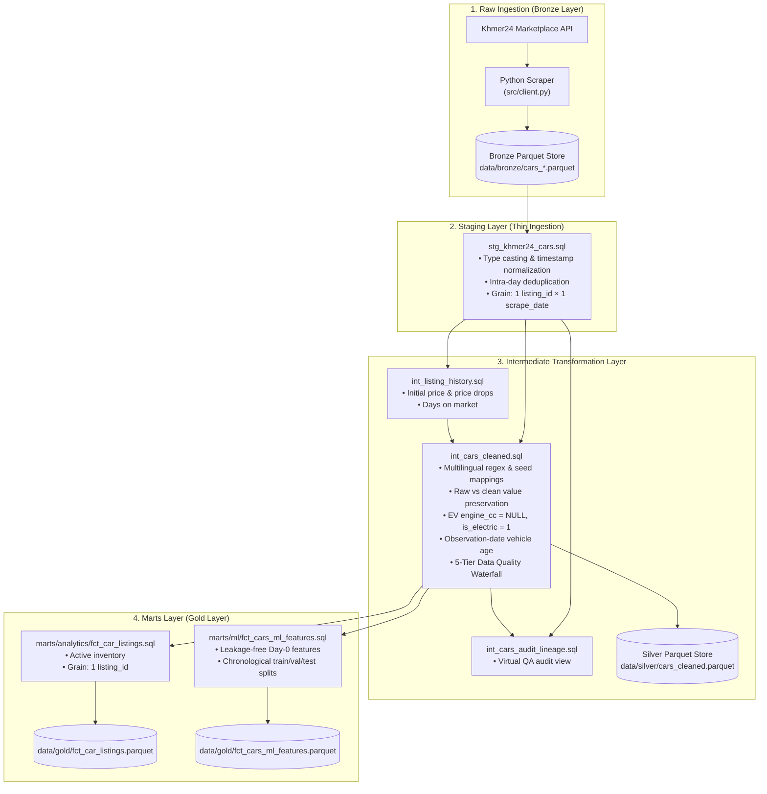

# 🚗 Cambodia Car Price Prediction & Market Intelligence

[](https://car-price-prediction-dq.streamlit.app/)
[](https://github.com/PHALMenghak/car-price-prediction/actions/workflows/run_tests.yml)
[](https://github.com/PHALMenghak/car-price-prediction/actions/workflows/daily_scraper.yml)
[](https://www.python.org/downloads/)
[](https://github.com/astral-sh/uv)
[](https://docs.getdbt.com/)
[](https://docs.pytest.org/)
[](https://docs.getdbt.com/)
[](LICENSE)

An automated data pipeline and machine learning project to predict used car prices and analyze automotive market trends in Cambodia.

The system automatically collects car listings from **Khmer24**, cleans multilingual text (Khmer, English, Chinese), standardizes vehicle specifications, enforces data contracts, and prepares clean datasets for machine learning models and analytics dashboards.

> 🌐 **Live Data Quality & Observability Dashboard**: Access the interactive cloud console at **[car-price-prediction-dq.streamlit.app](https://car-price-prediction-dq.streamlit.app/)**.

---

## 📌 Table of Contents

- [Project Overview](#-project-overview)
- [System Architecture (Medallion Standard)](#-system-architecture-medallion-standard)
- [Repository Structure](#-repository-structure)
- [Quick Start](#-quick-start)
- [How to Run the Pipeline](#-how-to-run-the-pipeline)
  - [1. Scrape Raw Data](#1-scrape-raw-data)
  - [2. Run Data Transformations &amp; Contract Tests (dbt)](#2-run-data-transformations--contract-tests-dbt)
  - [3. Run Automated Unit Tests (pytest)](#3-run-automated-unit-tests-pytest)
  - [4. Launch Observability Console](#4-launch-observability-console)
- [Key Engineering Deliverables &amp; Documentation](#-key-engineering-deliverables--documentation)
- [Author &amp; Internship Information](#-author--internship-information)

---

## 🌟 Project Overview

In Cambodia, used car pricing can be difficult to predict because:

1. **Multilingual Listings**: Sellers write titles mixing Khmer (`ឡានលក់ Prius 07`), Chinese (`2026年海拉克斯`), and English (`Lexus Rx300 Full Option`).
2. **Missing Form Data**: Key details like model year, mileage, engine size, and tax status are often written inside the description or title rather than selected in dropdown forms.
3. **Price Variation**: Newly imported cars with "Tax Paper" (`ក្រដាសពន្ធ`) sell at a premium compared to registered "Plate Number" (`ផ្លាកលេខ`) cars.
4. **Financing Traps & Typo Outliers**: Installment down payments ($500–$2,000) or extra zero typos ($150,000 for a 2007 Prius) distort pricing models if not cleaned.

### Our Solution

This project implements an industry-grade **Medallion Architecture (Bronze $\to$ Silver $\to$ Gold)** operating on **dbt Core** and **DuckDB**:

* **Bronze**: 100% immutable raw daily Parquet snapshots.
* **Staging**: Thin normalization, type casting, and intra-day deduplication (`stg_khmer24_cars.sql`).
* **Intermediate**: Longitudinal history tracking (`int_listing_history.sql`), multi-source cleaning (`int_cars_cleaned.sql`), and before/after QA lineage (`int_cars_audit_lineage.sql`).
* **Gold Marts**:
  - **BI Analytics**: `fct_car_listings.sql` (curated active inventory).
  - **Machine Learning**: `fct_cars_ml_features.sql` (leakage-free Day-0 appraisal features, target variables, and chronological train/validation/test splits).

---

## 💎 System Architecture (Medallion Standard)


```mermaid
flowchart TD
    subgraph S1["1. Raw Ingestion (Bronze Layer)"]
        A["Khmer24 Marketplace API"] --> B["Python Scraper\n(src/client.py)"]
        B --> C[("Bronze Parquet Store\ndata/bronze/cars_*.parquet")]
    end

    subgraph S2["2. Staging Layer (Thin Ingestion)"]
        C --> D["stg_khmer24_cars.sql\n• Type casting & timestamp normalization\n• Intra-day deduplication\n• Grain: 1 listing_id × 1 scrape_date"]
    end

    subgraph S3["3. Intermediate Transformation Layer"]
        D --> E["int_listing_history.sql\n• Initial price & price drops\n• Days on market"]
        D --> F["int_cars_cleaned.sql\n• Multilingual regex & seed mappings\n• Raw vs clean value preservation\n• EV engine_cc = NULL, is_electric = 1\n• Observation-date vehicle age\n• 5-Tier Data Quality Waterfall"]
        E --> F
        D --> G["int_cars_audit_lineage.sql\n• Virtual QA audit view"]
        F --> G
        F --> H[("Silver Parquet Store\ndata/silver/cars_cleaned.parquet")]
    end

    subgraph S4["4. Marts Layer (Gold Layer)"]
        F --> J["marts/analytics/fct_car_listings.sql\n• Active inventory\n• Grain: 1 listing_id"]
        F --> K["marts/ml/fct_cars_ml_features.sql\n• Leakage-free Day-0 features\n• Chronological train/val/test splits"]
        J --> L[("data/gold/fct_car_listings.parquet")]
        K --> M[("data/gold/fct_cars_ml_features.parquet")]
    end
```

---

## 📂 Repository Structure

```text
Car_price_prediction/
├── AUDIT_REPORT.md                 # Complete Senior Engineering Audit Report (10 findings & fixes)
├── ARCHITECTURE.md                 # System Architecture & Layer Specifications
├── DATA_QUALITY.md                 # Data Quality Framework (Waterfall, Outliers, 107 Tests)
├── ML_STRATEGY.md                  # Valuation Strategy & Leakage Prevention Architecture
│
├── data/
│   ├── bronze/                     # Raw Parquet snapshots (cars_YYYY-MM-DD.parquet)
│   ├── silver/                     # Cleaned conformed data (cars_cleaned.parquet)
│   ├── gold/                       # Star schema & ML feature store (fct_cars_ml_features.parquet)
│   └── duckdb/                     # DuckDB analytical database (khmer24.duckdb)
│
├── dbt/                            # Data Transformation Layer (dbt Core + DuckDB)
│   ├── dbt_project.yml             # dbt project configuration
│   ├── profiles.yml                # DuckDB connection profile
│   ├── macros/
│   │   ├── text/                   # clean_text.sql
│   │   ├── parsing/                # parse_mileage.sql, parse_engine.sql, parse_year.sql
│   │   └── quality/                # detect_spam.sql, detect_down_payment.sql,
│   │                               # detect_price_outlier.sql, classify_brand_tier.sql,
│   │                               # extract_nlp_signals.sql
│   ├── seeds/                      # Canonical controlled vocabularies (brand, model, location...)
│   ├── models/
│   │   ├── staging/                # stg_khmer24_cars.sql
│   │   ├── intermediate/           # int_listing_history.sql, int_cars_cleaned.sql,
│   │   │                           # int_cars_audit_lineage.sql
│   │   ├── marts/
│   │   │   ├── analytics/          # fct_car_listings.sql
│   │   │   └── ml/                 # fct_cars_ml_features.sql
│   │   └── schema.yml              # 107 Automated data contract tests & schemas
│   └── tests/                      # Singular business contract tests
│
├── dashboard/                      # CARIQ Streamlit Automotive Intelligence Console
│   ├── app.py                      # Main dashboard application & navigation router
│   ├── config.py                   # UI tokens, SLA gates & DHI scoring rules
│   ├── services/                   # High-speed DuckDB analytics & ML inference
│   │   ├── duckdb_service.py       # DuckDB analytical query layer
│   │   └── prediction_service.py   # Scikit-learn inference & SHAP explainability
│   └── views/                      # 5 Production Views (Market Overview, Explorer, Prediction, Insights, DQ)
│
├── pipeline/                       # Orchestration & Pipeline Runners
│   ├── extract_load.py             # Extraction and Bronze storage logic
│   └── dbt_runner.py               # Programmatic dbt runner
│
├── src/                            # Core Python Modules
│   ├── client.py                   # Khmer24 API and detail scraper
│   ├── schemas.py                  # Pydantic data schemas
│   └── storage.py                  # Parquet file handlers
│
├── tests/                          # Unit Test Suite (28 pytest assertions)
├── notebooks/                      # Jupyter Research & ML Notebooks
├── pyproject.toml                  # Dependencies & project metadata
└── uv.lock                         # Deterministic dependency lockfile
```

---

## 🚀 Quick Start

### Prerequisites

* **Python 3.11+**
* **[uv](https://github.com/astral-sh/uv)** (Fast Python package manager)

### Installation

```bash
# 1. Clone the repository
git clone https://github.com/PHALMenghak/car-price-prediction.git
cd car-price-prediction

# 2. Install all dependencies in a virtual environment
uv sync
```

---

## ⚡ How to Run the Pipeline

### 1. Scrape Raw Data

Scrape car listings with full detail specifications into `data/bronze/`:

```bash
# Scrape 20 pages with detail enrichment
uv run python main.py --max-pages 20 --enrich-details
```

### 2. Run Data Transformations & Contract Tests (dbt)

Run the full Medallion pipeline and validate all 107 data contracts:

```bash
# Run all transformations + execute all 107 contract tests
uv run python pipeline/dbt_runner.py all

# Run transformations only
uv run python pipeline/dbt_runner.py run

# Run contract tests only
uv run python pipeline/dbt_runner.py test
```

### 3. Run Automated Unit Tests (pytest)

Execute the Python test suite:

```bash
uv run pytest tests/ -v
```

### 4. Launch Observability Console

Explore the interactive 3-pillar Data Pipeline & Quality Observability Console:

* **🌐 Live Hosted Cloud Deployment**: **[https://car-price-prediction-dq.streamlit.app/](https://car-price-prediction-dq.streamlit.app/)**
* **💻 Run Locally**:
  ```bash
  uv run streamlit run dashboard/app.py
  ```

---

## 📖 Key Engineering Deliverables & Documentation

* 📋 [**Audit Report (`AUDIT_REPORT.md`)**](AUDIT_REPORT.md) — Comprehensive technical audit detailing all 10 problems identified, severities, root causes, implemented refactorings, and interview defenses.
* 🏛️ [**System Architecture (`ARCHITECTURE.md`)**](ARCHITECTURE.md) — Medallion platform design, layer responsibilities, grain contracts, and data flow.
* 🛡️ [**Data Quality Framework (`DATA_QUALITY.md`)**](DATA_QUALITY.md) — 5-tier waterfall classification, dual-axis outlier detection, EV displacement semantics, and 107 contract assertions.
* 🤖 [**ML Strategy & Valuation Architecture (`ML_STRATEGY.md`)**](ML_STRATEGY.md) — Day-0 appraisal feature matrix, target engineering (`log_price`), leakage prevention, and chronological splitting.
* 📘 [**Data Dictionary (`docs/DATA_DICTIONARY.md`)**](docs/DATA_DICTIONARY.md) — Full dictionary of raw attributes, conformed Silver fields, and ML feature variables.

---

## 👤 Author & Internship Information

* **Author**: **Phal Menghak**
* **Institution**: **Institute of Technology of Cambodia (ITC)**
* **Department**: Applied Mathematics and Statistics (AMS) — Year 4
* **Role**: Data Science & Machine Learning Engineer Intern
* **GitHub**: [@PHALMenghak](https://github.com/PHALMenghak)

---

## 📜 License

This project is licensed under the MIT License — see the [LICENSE](LICENSE) file for details.
