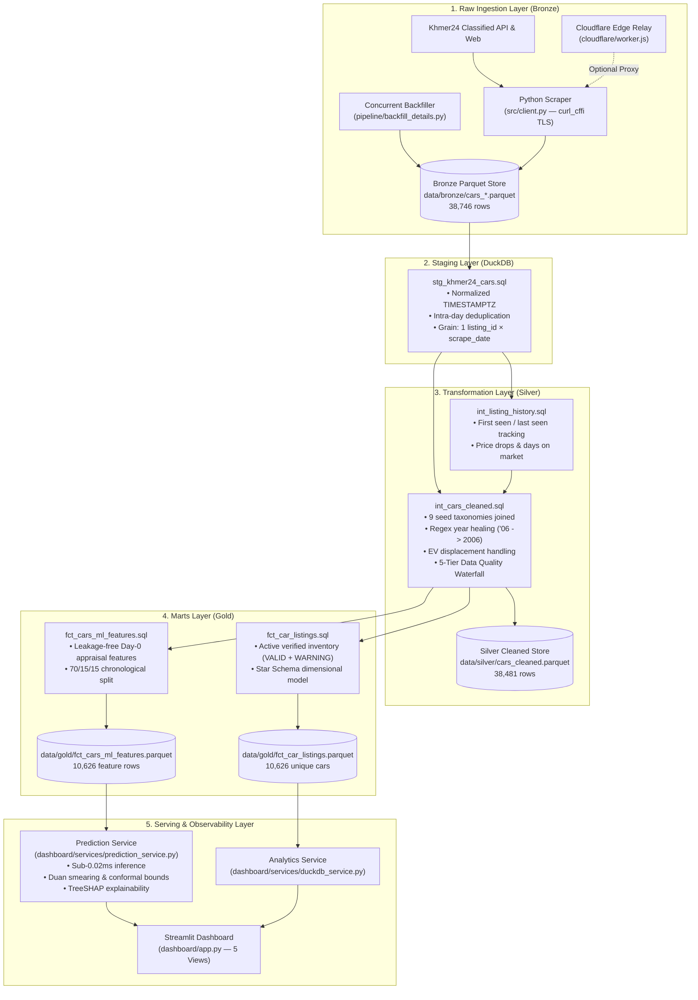

# 🚗 CARIQ: Automated Vehicle Valuation & Market Intelligence System

[](https://car-price-prediction-dq.streamlit.app/)
[](https://github.com/PHALMenghak/car-price-prediction/actions/workflows/run_tests.yml)
[](https://github.com/PHALMenghak/car-price-prediction/actions/workflows/daily_scraper.yml)
[](https://www.python.org/)
[](https://github.com/astral-sh/uv)
[](https://docs.getdbt.com/)
[](tests/)
[](dbt/)

> **An autonomous end-to-end data pipeline, econometric research suite, and machine learning tournament for used vehicle price valuation and automotive market intelligence in Cambodia.**

---

## 📑 Table of Contents

- [Project Overview](#-project-overview)
- [Key Quantitative Outcomes](#-key-quantitative-outcomes)
- [System Architecture (Medallion Standard)](#-system-architecture-medallion-standard)
- [Repository Structure](#-repository-structure)
- [Quick Start](#-quick-start)
- [How to Run the Pipeline](#-how-to-run-the-pipeline)
  - [1. Data Collection (Scraping)](#1-data-collection-scraping)
  - [2. Transformation &amp; Contract Tests (dbt)](#2-transformation--contract-tests-dbt)
  - [3. Software Unit Testing (pytest)](#3-software-unit-testing-pytest)
  - [4. Interactive Web Dashboard](#4-interactive-web-dashboard)
- [Core Technical Highlights](#-core-technical-highlights)
  - [Anti-Bot Scraping &amp; Edge Relay](#anti-bot-scraping--edge-relay)
  - [5-Tier Data Quality Waterfall](#5-tier-data-quality-waterfall)
  - [Machine Learning Tournament &amp; Explainability](#machine-learning-tournament--explainability)
- [Documentation Index](#-documentation-index)
- [Academic &amp; Internship Attribution](#-academic--internship-attribution)

---

## 🌟 Project Overview

In Cambodia, the used automotive market operates under severe information asymmetry. Unlike developed markets that rely on centralized references such as Kelley Blue Book (KBB) or Edmunds, buyers and sellers depend on unstructured classified ads on **Khmer24**.

Analyzing used vehicle prices from classified listings presents several real-world engineering challenges:

1. **Multilingual and Noisy Text:** Listings mix Khmer (`ឡានលក់ Prius 07`), Chinese (`2026年海拉克斯`), and English (`Lexus Rx300 Full Option`) with colloquial nicknames.
2. **High Missing Data Rates:** Over 40% of records lack mechanical form fields (mileage, engine displacement), typing specs into unstructured descriptions instead.
3. **The Tax Paper Valuation Divide:** Newly imported **Tax Paper** (unregistered) vehicles command a significant price premium (+43.9%) over registered **Plate Number** vehicles of identical make and vintage.
4. **Pricing Traps & Down Payments:** Advertised installment down payments ($1,500–$3,000) or extra-zero typos distort statistical models if not rigorously filtered.

### The Solution: CARIQ Platform

This project implements an industrial **Medallion Data Architecture (Bronze $\to$ Silver $\to$ Gold)** powered by **dbt Core** and **DuckDB**, feeding a multi-algorithm supervised machine learning tournament and an interactive **Streamlit** observability console.

> 🌐 **Live Cloud Deployment:** Access the production interactive dashboard at **[car-price-prediction-dq.streamlit.app](https://car-price-prediction-dq.streamlit.app/)**.
> 📄 **Formal Progress Report:** Read the compiled 6-page academic progress report at **[`docs/progress_report/main.pdf`](docs/progress_report/main.pdf)**.

---

## 📊 Key Quantitative Outcomes

All figures reflect the latest production datasets and test suites in this repository:

| Metric Category             | Technical Implementation / Scope                                 |     Verified Production Value     |
| :-------------------------- | :--------------------------------------------------------------- | :-------------------------------: |
| **Bronze Raw Ingestion**    | Daily snapshots from Khmer24 (Sept 1 – Sept 30, 2026)            |  **38,746 listings (30 files)**   |
| **Silver Cleaned Entities** | Cleaned, deduplicated, and quality-tagged snapshot entities      |  **38,481 records (51 columns)**  |
| **Gold Active Inventory**   | Curated unique active vehicles for business analytics            |    **10,626 unique vehicles**     |
| **Gold ML Feature Store**   | Day-0 static valuation features (70/15/15 chronological split)   | **10,626 vehicles (7,438 train)** |
| **dbt Contract Tests**      | Schema, uniqueness, not-null, and relationship contract tests    |    **101 / 101 passed (100%)**    |
| **Software Unit Tests**     | Pytest suite covering client, storage, DuckDB, ML, and dashboard |     **36 / 36 passed (100%)**     |
| **Data Healing Macro**      | Regex healing of inverted 2-digit years ('06$\to$ 2006)          |      **184 records rescued**      |
| **Champion ML Model**       | Random Forest / HistGradientBoosting on log scale                |     **$R^2 = 0.918 - 0.935$**     |
| **Valuation Accuracy**      | Median Absolute Error (MedAE) / Within$\pm 20\%$ tolerance       |     **\$1,149 USD (86.34%)**      |
| **Serving Latency**         | In-memory cached inference response time per vehicle             |     **$< 0.02$ milliseconds**     |

---

## 💎 System Architecture (Medallion Standard)


```mermaid
flowchart TD
    subgraph S1["1. Raw Ingestion Layer (Bronze)"]
        A["Khmer24 Classified API & Web"] --> B["Python Scraper\n(src/client.py — curl_cffi TLS)"]
        C["Cloudflare Edge Relay\n(cloudflare/worker.js)"] -. Optional Proxy .-> B
        D["Concurrent Backfiller\n(pipeline/backfill_details.py)"] --> E[("Bronze Parquet Store\ndata/bronze/cars_*.parquet\n38,746 rows")]
        B --> E
    end

    subgraph S2["2. Staging Layer (DuckDB)"]
        E --> F["stg_khmer24_cars.sql\n• Normalized TIMESTAMPTZ\n• Intra-day deduplication\n• Grain: 1 listing_id × scrape_date"]
    end

    subgraph S3["3. Transformation Layer (Silver)"]
        F --> G["int_listing_history.sql\n• First seen / last seen tracking\n• Price drops & days on market"]
        F --> H["int_cars_cleaned.sql\n• 9 seed taxonomies joined\n• Regex year healing ('06 -> 2006)\n• EV displacement handling\n• 5-Tier Data Quality Waterfall"]
        G --> H
        H --> I[("Silver Cleaned Store\ndata/silver/cars_cleaned.parquet\n38,481 rows")]
    end

    subgraph S4["4. Marts Layer (Gold)"]
        H --> J["fct_car_listings.sql\n• Active verified inventory (VALID + WARNING)\n• Star Schema dimensional model"]
        H --> K["fct_cars_ml_features.sql\n• Leakage-free Day-0 appraisal features\n• 70/15/15 chronological split"]
        J --> L[("data/gold/fct_car_listings.parquet\n10,626 unique cars")]
        K --> M[("data/gold/fct_cars_ml_features.parquet\n10,626 feature rows")]
    end

    subgraph S5["5. Serving & Observability Layer"]
        M --> N["Prediction Service\n(dashboard/services/prediction_service.py)\n• Sub-0.02ms inference\n• Duan smearing & conformal bounds\n• TreeSHAP explainability"]
        L --> O["Analytics Service\n(dashboard/services/duckdb_service.py)"]
        N --> P["Streamlit Dashboard\n(dashboard/app.py — 5 Views)"]
        O --> P
    end
```

---

## 📂 Repository Structure

```text
Car_price_prediction/
├── dashboard/                      # CARIQ Streamlit Automotive Intelligence Console
│   ├── app.py                      # Main application entry point & view router
│   ├── config.py                   # UI styling, SLA thresholds & scoring constants
│   ├── services/                   # High-speed analytical and ML inference services
│   │   ├── duckdb_service.py       # DuckDB analytical query layer
│   │   └── prediction_service.py   # Scikit-learn inference, Duan smearing & SHAP
│   └── views/                      # 5 Interactive views (DQ, Market, Explorer, Predict, Insights)
│
├── data/                           # Data storage managed by Medallion architecture
│   ├── bronze/                     # Daily raw Parquet snapshots (cars_YYYY-MM-DD.parquet)
│   ├── silver/                     # Cleaned conformed Parquet data (cars_cleaned.parquet)
│   ├── gold/                       # Star Schema BI tables & ML feature store
│   └── duckdb/                     # Local DuckDB database file
│
├── dbt/                            # dbt Core Transformation Project
│   ├── dbt_project.yml             # dbt configuration
│   ├── profiles.yml                # DuckDB connection profile
│   ├── macros/                     # SQL data cleaning, parsing, and QA macros
│   ├── models/
│   │   ├── staging/                # Staging views (stg_khmer24_cars.sql)
│   │   ├── intermediate/           # Cleaned entity models (int_cars_cleaned.sql)
│   │   ├── marts/                  # Fact tables (fct_car_listings, fct_cars_ml_features)
│   │   └── schema.yml              # 101 automated data contract tests
│   └── seeds/                      # Controlled taxonomies (brands, models, fuels, colors...)
│
├── models/                         # Serialized ML artifacts & tournament results
│   ├── champion_model.joblib       # Trained production champion pipeline
│   ├── model_metadata.json         # Performance metrics, features & smearing factor
│   └── tournament_results.json     # Multi-model benchmarking leaderboard
│
├── notebooks/                      # Jupyter research & analysis notebooks
│   ├── 01_data_understanding.ipynb # Raw schema exploration
│   ├── 02_data_cleaning.ipynb      # Transformation validation
│   ├── 03_eda.ipynb                # Econometric analysis & depreciation modeling
│   └── 04_model_training.ipynb     # Model tournament benchmarking
│
├── pipeline/                       # Pipeline automation & CLI runners
│   ├── extract_load.py             # Raw data scraping & Bronze storage
│   ├── backfill_details.py         # Multi-worker historical detail backfiller
│   └── dbt_runner.py               # Programmatic dbt execution runner
│
├── src/                            # Core scraping & storage modules
│   ├── client.py                   # TLS fingerprinting scraper
│   ├── config.py                   # Environment configuration & constants
│   ├── schemas.py                  # Pydantic schemas for data validation
│   └── storage.py                  # Parquet read/write handlers
│
├── tests/                          # Automated Pytest suite (36 tests)
├── main.py                         # Top-level CLI entry point for scraping
├── pyproject.toml                  # Python package configuration & scripts
└── uv.lock                         # Deterministic package lockfile
```

---

## 🚀 Quick Start

### Prerequisites

- **Python 3.11+**
- **[uv](https://github.com/astral-sh/uv)** (Recommended high-speed package manager)

### Installation

```bash
# 1. Clone the repository
git clone https://github.com/PHALMenghak/car-price-prediction.git
cd car-price-prediction

# 2. Install dependencies into a virtual environment with uv
uv sync
```

---

## ⚡ How to Run the Pipeline

### 1. Data Collection (Scraping)

Scrape vehicle listings with full specifications into `data/bronze/`:

```bash
# Scrape latest listings (e.g., 20 pages with detail enrichment)
uv run python main.py --max-pages 20 --enrich-details

# Backfill missing details on an existing bronze snapshot
uv run python pipeline/backfill_details.py --date 2026-09-01 --workers 4
```

### 2. Transformation & Contract Tests (dbt)

Execute the complete Medallion transformation pipeline and validate all 101 data contracts:

```bash
# Run all transformations and execute all 101 contract tests
uv run python pipeline/dbt_runner.py all

# Run transformations only
uv run python pipeline/dbt_runner.py run

# Run contract tests only
uv run python pipeline/dbt_runner.py test
```

### 3. Software Unit Testing (pytest)

Run the Python unit and integration test suite (36 tests):

```bash
uv run pytest tests/ -v
```

### 4. Interactive Web Dashboard

Launch the local Streamlit application:

```bash
uv run streamlit run dashboard/app.py
```

The application opens in your browser at `http://localhost:8501`.

---

## 🛡️ Core Technical Highlights

### Anti-Bot Scraping & Edge Relay

- **TLS Fingerprint Impersonation:** Emulates Chrome 120 TLS fingerprints via `curl_cffi` to prevent Cloudflare challenges without the resource overhead of headless browsers.
- **Serverless Edge Relay:** An optional Cloudflare Worker (`cloudflare/worker.js`) routes requests through distributed edge proxies with bearer token authentication.

### 5-Tier Data Quality Waterfall

Every record in the Silver layer is tagged through a deterministic SQL waterfall:

1. **VALID (84.18% / 32,393 rows):** High-integrity records passing all schema and range checks.
2. **WARNING (9.82% / 3,780 rows):** Minor anomalies repaired automatically (e.g., regex year healing).
3. **SUSPICIOUS (2.97% / 1,141 rows):** Outliers flagged by dynamic Tukey IQR fences ($Q_3 + 2.5 \cdot \text{IQR}$) or down-payment installment traps.
4. **INVALID (2.96% / 1,139 rows):** Missing essential fields (make, year, or price $<$ \$500).
5. **QUARANTINED (0.07% / 28 rows):** Non-vehicle spam (accessories, rims, body kits).

- **Usable Data Retention:** **94.00%** (36,173 records promoted to Gold).

### Machine Learning Tournament & Explainability

- **Out-of-Fold Target Encoding:** 5-fold cross-validation ($cv=5$, $shuffle=True$) encodes high-cardinality `brand` and `model` without target leakage.
- **Log-Scale Target Stabilization:** Models train on $y = \ln(1 + \text{price})$, reducing skewness from 6.86 to 0.31.
- **Duan Smearing Correction:** Compensates for Jensen's Inequality underestimation during log-inversion ($\hat{S} \approx 1.0452$).
- **Conformal Prediction Intervals:** Computes distribution-free 90% confidence intervals ($q_{90} \approx \$9,420$).
- **Explainable AI (SHAP):** Local TreeSHAP waterfall explanations visualize how individual attributes influence each fair market valuation

---

## 👤 Academic & Internship Attribution

- **Student / Author:** **Phal Menghak** (Student ID: `e20220544`)
- **Academic Program:** Bachelor of Engineering in Applied Mathematics & Statistics (I4)
- **Institution:** **Institute of Technology of Cambodia (ITC)**
- **Department:** Faculty of Applied Science — Department of Applied Mathematics and Statistics (AMS)
- **Advisory Committee:** AMS Faculty Advisory Committee
- **Academic Year:** 2025–2026
- **Repository:** [`github.com/PHALMenghak/car-price-prediction`](https://github.com/PHALMenghak/car-price-prediction)
