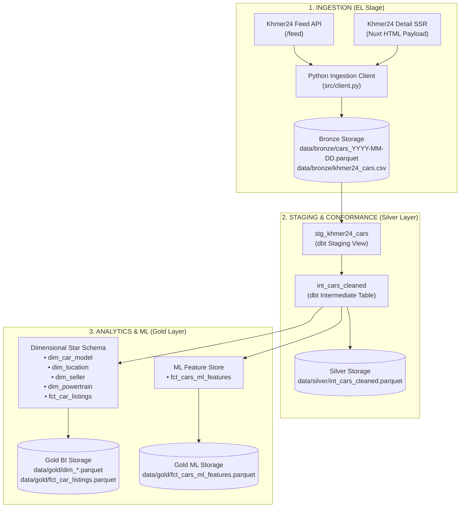
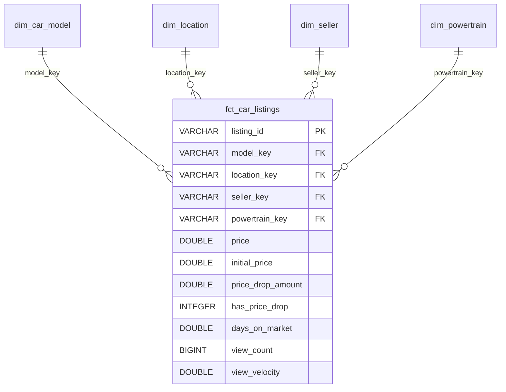

# 📖 Data Dictionary — Cambodia Used Car Price Prediction & Market Intelligence

> **Project**: Cambodia Used Car Price Prediction & Market Intelligence  
> **Architecture**: Medallion Data Architecture (Bronze $\to$ Silver $\to$ Gold)  
> **Processing Engine**: dbt Core + DuckDB Analytical Engine  
> **Storage Formats**: Apache Parquet (Columnar Storage) & RFC-4180 CSV  
> **Last Updated**: 2026-09-02  

---

## 📑 Table of Contents
1. [Architecture Overview & Data Flow](#1-architecture-overview--data-flow)
2. [Bronze Layer: Raw Ingestion Schema (35 Columns)](#2-bronze-layer-raw-ingestion-schema)
3. [Silver Layer: Conformed Intermediate Schema (`int_cars_cleaned`)](#3-silver-layer-conformed-intermediate-schema)
4. [Gold Layer: Dimensional Star Schema (Analytics & BI)](#4-gold-layer-dimensional-star-schema)
5. [Gold Layer: Machine Learning Feature Store (`fct_cars_ml_features`)](#5-gold-layer-machine-learning-feature-store)
6. [Data Quality Contracts & SLA Validation](#6-data-quality-contracts--sla-validation)

---

## 1. Architecture Overview & Data Flow

The data platform follows the **Medallion Architecture** to guarantee data integrity, reproducibility, and separation of concerns across extraction, cleaning, analytical reporting, and ML feature engineering:



---

## 2. Bronze Layer: Raw Ingestion Schema

* **Storage Path**: `data/bronze/cars_YYYY-MM-DD.parquet` (Daily Snapshots) & `data/bronze/khmer24_cars.csv`
* **Schema Definition**: [`RawCarListing` in `src/schemas.py`](file:///D:/ITC3_AMS_2025/I4_AMS_S2/Y4_Internship/Car_price_prediction/src/schemas.py)
* **Description**: Complete, immutable capture of raw marketplace listings. Contains 35 standard attributes without lossy transformations or artificial normalization.

### 2.1 Identity & Pricing
| Column Name | Data Type | Nullable | Description & Example Values |
| :--- | :--- | :---: | :--- |
| `listing_id` | `VARCHAR` | No | Unique marketplace identifier assigned by Khmer24 (e.g., `'13944577'`). |
| `raw_title` | `VARCHAR` | Yes | Unprocessed listing headline as entered by seller (e.g., `'Lexus Rx400h 2006 Full Option'`). |
| `raw_price` | `VARCHAR` | Yes | Raw asking price string as posted (e.g., `'15500.00'`, `'15500'`, `'$15,500'`). |
| `raw_currency` | `VARCHAR` | No | Currency denomination (default `'USD'`). |

### 2.2 Raw Vehicle Specifications (`raw_spec_*`)
| Column Name | Data Type | Nullable | Source & Extraction Rules |
| :--- | :--- | :---: | :--- |
| `raw_spec_brand` | `VARCHAR` | Yes | Vehicle make from detail specs / feed (e.g., `'Toyota'`, `'Lexus'`, `'Ford'`). |
| `raw_spec_model` | `VARCHAR` | Yes | Vehicle model line (e.g., `'Prius'`, `'RX300'`, `'Ranger'`). |
| `raw_spec_year` | `VARCHAR` | Yes | 4-digit model year from detail specs, feed `highlight_specs`, or detail `meta_keywords` (`'2006'`). |
| `raw_spec_mileage` | `VARCHAR` | Yes | Odometer distance text (e.g., `'80,000 km'`, `'50000'`). |
| `raw_spec_engine_size` | `VARCHAR` | Yes | Displacement string (e.g., `'1.8L'`, `'3500cc'`, `'2.0'`). |
| `raw_spec_fuel_type` | `VARCHAR` | Yes | Fuel type tag (e.g., `'Gasoline'`, `'Petrol'`, `'Diesel'`, `'Hybrid'`, `'Electric'`). |
| `raw_spec_transmission`| `VARCHAR` | Yes | Transmission type (e.g., `'Auto'`, `'Manual'`, `'លេខដៃ'`). |
| `raw_spec_color` | `VARCHAR` | Yes | Exterior body color (e.g., `'White'`, `'Black'`, `'Silver'`, `'ពណ៌ស'`). |
| `raw_spec_condition` | `VARCHAR` | Yes | Vehicle condition indicator (`'Used'`, `'New'`, `'មួយ​ទឹក'`). |
| `raw_spec_tax_type` | `VARCHAR` | Yes | Registration & tax clearance status (`'Plate Number'`, `'Tax Paper'`, `'ក្រដាសពន្ធ'`). |
| `raw_spec_steering` | `VARCHAR` | Yes | Steering wheel orientation (e.g., `'Left'`, `'Right'`). |
| `raw_spec_body_type` | `VARCHAR` | Yes | Vehicle chassis class (e.g., `'SUV'`, `'Sedan'`, `'Pickup'`, `'Van'`). |

### 2.3 Geographic Location
| Column Name | Data Type | Nullable | Description & Example Values |
| :--- | :--- | :---: | :--- |
| `raw_province` | `VARCHAR` | Yes | Province/Municipality name (e.g., `'Phnom Penh'`, `'Siem Reap'`, `'Kandal'`). |
| `raw_district` | `VARCHAR` | Yes | Second-level administrative district/Khan (e.g., `'Chamkar Mon'`, `'Toul Kork'`). |

### 2.4 Seller & Merchant Attributes
| Column Name | Data Type | Nullable | Description & Example Values |
| :--- | :--- | :---: | :--- |
| `seller_id` | `VARCHAR` | Yes | Unique seller account identifier on Khmer24 (e.g., `'484959'`). |
| `seller_name` | `VARCHAR` | Yes | Display name or dealership brand of the seller. |
| `seller_type_code` | `VARCHAR` | No | Account classification code (`'1'` = Individual seller, `'2'` = Verified dealer/store). |
| `seller_username` | `VARCHAR` | Yes | Public handle / slug of the seller profile. |
| `seller_phones` | `VARCHAR[]` | No | Array of contact phone numbers extracted from listing payload (e.g., `['086516666']`). |

### 2.5 Listing Content, Media & Operational Metadata
| Column Name | Data Type | Nullable | Description & Example Values |
| :--- | :--- | :---: | :--- |
| `raw_description` | `VARCHAR` | Yes | Full verbatim text body of the listing (up to several thousand characters). |
| `thumbnail_url` | `VARCHAR` | Yes | Primary low-resolution preview image URL. |
| `listing_url` | `VARCHAR` | No | Canonical web URL of the listing on Khmer24. |
| `images` | `VARCHAR[]` | No | Array of full-resolution image URLs hosted on Khmer24 CDN. |
| `view_count` | `INTEGER` | No | Cumulative page views recorded at scrape time. |
| `posted_at` | `VARCHAR` | Yes | Original listing creation timestamp (ISO-8601 or Khmer24 date format). |
| `renewed_at` | `VARCHAR` | Yes | Latest bump/renewal timestamp by seller. |
| `scraped_at` | `VARCHAR` | No | UTC timestamp when this record was ingested into Bronze. |
| `detail_source` | `VARCHAR` | No | Protocol used to retrieve specs (`'nuxt_html'`, `'api'`, or `'none'`). |
| `has_detail` | `BOOLEAN` | No | `True` if enriched with detail page specs, `False` if feed-only. |
| `raw_feed_payload` | `VARCHAR` | Yes | JSON string of the raw feed API response object (audit trail). |
| `raw_detail_payload` | `VARCHAR` | Yes | JSON string of the raw detail response object (audit trail). |

---

## 3. Silver Layer: Conformed Intermediate Schema

* **Storage Path**: `data/silver/int_cars_cleaned.parquet` & `data/silver/int_cars_cleaned.csv`
* **dbt Model**: [`dbt/models/intermediate/int_cars_cleaned.sql`](file:///D:/ITC3_AMS_2025/I4_AMS_S2/Y4_Internship/Car_price_prediction/dbt/models/intermediate/int_cars_cleaned.sql)
* **Description**: Deduplicated, standardized, and conformed tabular layer. Applies regex normalization, translations for Khmer terminology, longitudinal tracking, and domain sanity boundaries.

| Column Name | Target Type | Business Transformation & Sanity Bounds |
| :--- | :--- | :--- |
| `listing_id` | `VARCHAR` (PK) | Primary Key. Multi-day deduplication keeps the latest state per ID. |
| `listing_title` | `VARCHAR` | Normalized and trimmed listing title. |
| `price` | `DOUBLE` | Current valid asking price in USD. Clamped to: **$500 $\le$ Price $\le$ $300,000**. |
| `initial_price` | `DOUBLE` | Earliest price observed across historical snapshots for longitudinal tracking. |
| `price_drop_amount` | `DOUBLE` | Price drop amount in USD: `GREATEST(initial_price - price, 0.0)`. |
| `has_price_drop` | `INTEGER` | Binary flag: `1` if listing price was reduced, `0` otherwise. |
| `price_increase_amount` | `DOUBLE` | Price increase amount in USD: `GREATEST(price - initial_price, 0.0)`. |
| `has_price_increase` | `INTEGER` | Binary flag: `1` if price was raised, `0` otherwise. |
| `days_on_market` | `DOUBLE` | Active duration: `ROUND(JULIANDAY(scraped_at) - JULIANDAY(first_posted_at), 1)`. |
| `view_count` | `BIGINT` | Cleaned integer page view count. |
| `view_velocity` | `DOUBLE` | Daily view engagement rate: `view_count / GREATEST(days_on_market, 0.5)`. |
| `vehicle_brand` | `VARCHAR` | Standardized manufacturer (e.g. `Toyota`, `Lexus`, `Ford`, `Mercedes-Benz`, `BYD`). |
| `vehicle_model` | `VARCHAR` | Conformed model name (e.g. `Prius`, `Camry`, `RX350`, `Ranger`, `Model Y`). |
| `vehicle_model_year` | `INTEGER` | Bounded model year: **1990 $\le$ Year $\le$ 2027**; otherwise `NULL`. |
| `vehicle_mileage_km` | `BIGINT` | Normalized odometer reading in km: **0 $\le$ km $\le$ 500,000**; otherwise `NULL`. |
| `vehicle_engine_cc` | `INTEGER` | Displacement in cc: **500 $\le$ cc $\le$ 7,000** (or `0` for EVs); otherwise `NULL`. |
| `vehicle_fuel_type` | `VARCHAR` | Standardized category: `Petrol`, `Diesel`, `Hybrid`, `Electric`, `LPG`, `Unknown`. |
| `vehicle_transmission`| `VARCHAR` | Standardized gearbox: `Automatic` vs `Manual`. |
| `vehicle_color` | `VARCHAR` | Normalized English color name: `White`, `Black`, `Silver`, `Grey`, `Gold`, `Blue`, `Red`, etc. |
| `vehicle_condition` | `VARCHAR` | Normalized binary condition: `used` vs `new`. |
| `vehicle_tax_type` | `VARCHAR` | Standardized tax status: `Plate Number` vs `Tax Paper`. |
| `province` | `VARCHAR` | Standardized province name (defaults to `'Phnom Penh'` if unstated). |
| `district` | `VARCHAR` | Cleaned district/Khan name. |
| `seller_id` | `VARCHAR` | Account ID of seller. |
| `seller_name` | `VARCHAR` | Standardized seller name. |
| `seller_type` | `VARCHAR` | Categorized seller type: `store` (dealer) vs `individual`. |
| `seller_username` | `VARCHAR` | Public handle of seller. |
| `seller_phones` | `VARCHAR[]` | Array of clean contact telephone numbers. |
| `raw_description` | `VARCHAR` | Full seller description text. |
| `thumbnail_url` | `VARCHAR` | Main thumbnail link. |
| `listing_url` | `VARCHAR` | Web listing URL. |
| `images` | `VARCHAR[]` | Array of CDN photo URLs. |
| `posted_at` | `TIMESTAMP` | First observed listing timestamp. |
| `scraped_at` | `TIMESTAMP` | Latest snapshot timestamp. |

---

## 4. Gold Layer: Dimensional Star Schema

The Gold Dimensional layer creates a star schema optimized for Business Intelligence dashboards, market analysis, and analytical queries in Power BI, Tableau, or DuckDB.



### 4.1 Dimension: `dim_car_model`
* **Grain**: One row per distinct vehicle make, model, and body configuration.
* **Primary Key**: `model_key` (`MD5(vehicle_brand || vehicle_model || body_type)`)

| Column Name | Data Type | Description |
| :--- | :--- | :--- |
| `model_key` | `VARCHAR` (PK) | Surrogate MD5 hash key. |
| `vehicle_brand` | `VARCHAR` | Standardized brand/make. |
| `vehicle_model` | `VARCHAR` | Canonical model name. |
| `brand_tier` | `VARCHAR` | Market segment: `Luxury`, `Mass_Market`, `Chinese_EV`, `Other`. |
| `body_type` | `VARCHAR` | `SUV`, `Sedan`, `Pickup`, `Van`, `Coupe`, `Hatchback`, `Unknown`. |

### 4.2 Dimension: `dim_location`
* **Grain**: One row per distinct geographical province and district.
* **Primary Key**: `location_key` (`MD5(province || district)`)

| Column Name | Data Type | Description |
| :--- | :--- | :--- |
| `location_key` | `VARCHAR` (PK) | Surrogate MD5 hash key. |
| `province` | `VARCHAR` | Cambodia province / municipality. |
| `district` | `VARCHAR` | District / Khan name. |
| `location_tier` | `VARCHAR` | Economic liquidity tier: `Tier_1` (Phnom Penh), `Tier_2` (Major Cities), `Tier_3` (Regional). |

### 4.3 Dimension: `dim_seller`
* **Grain**: One row per unique seller account entity.
* **Primary Key**: `seller_key` (`MD5(seller_id)`)

| Column Name | Data Type | Description |
| :--- | :--- | :--- |
| `seller_key` | `VARCHAR` (PK) | Surrogate MD5 hash key. |
| `seller_id` | `VARCHAR` | Unique seller account ID. |
| `seller_name` | `VARCHAR` | Seller display name. |
| `seller_type` | `VARCHAR` | `store` (dealership) vs `individual`. |
| `seller_username` | `VARCHAR` | Store handle or profile username. |
| `seller_phones` | `VARCHAR[]` | Contact phone numbers. |

### 4.4 Dimension: `dim_powertrain`
* **Grain**: One row per unique combination of engine cc, fuel type, and transmission.
* **Primary Key**: `powertrain_key` (`MD5(fuel || transmission || engine_cc)`)

| Column Name | Data Type | Description |
| :--- | :--- | :--- |
| `powertrain_key` | `VARCHAR` (PK) | Surrogate MD5 hash key. |
| `vehicle_fuel_type` | `VARCHAR` | `Petrol`, `Diesel`, `Hybrid`, `Electric`, `LPG`, `Unknown`. |
| `vehicle_transmission`| `VARCHAR` | `Automatic` vs `Manual`. |
| `vehicle_engine_cc` | `INTEGER` | Displacement in cc (0 for electric). |

### 4.5 Fact Table: `fct_car_listings`
* **Grain**: One row per active unique car listing.
* **Primary Key**: `listing_id`

| Column Name | Data Type | Description |
| :--- | :--- | :--- |
| `listing_id` | `VARCHAR` (PK) | Unique listing identifier. |
| `model_key` | `VARCHAR` (FK) | Foreign key to `dim_car_model`. |
| `location_key` | `VARCHAR` (FK) | Foreign key to `dim_location`. |
| `seller_key` | `VARCHAR` (FK) | Foreign key to `dim_seller`. |
| `powertrain_key` | `VARCHAR` (FK) | Foreign key to `dim_powertrain`. |
| `price` | `DOUBLE` | Current validated price in USD. |
| `initial_price` | `DOUBLE` | Initial observed asking price. |
| `price_drop_amount` | `DOUBLE` | Cumulative discount in USD. |
| `has_price_drop` | `INTEGER` | Binary flag (1 if discounted). |
| `price_increase_amount`| `DOUBLE` | Cumulative price increase in USD. |
| `has_price_increase`| `INTEGER` | Binary flag (1 if price raised). |
| `days_on_market` | `DOUBLE` | Total days active on Khmer24. |
| `view_count` | `BIGINT` | Total view count. |
| `view_velocity` | `DOUBLE` | Average daily page views. |
| `posted_at` | `TIMESTAMP` | First posted timestamp. |
| `scraped_at` | `TIMESTAMP` | Snapshot timestamp. |

---

## 5. Gold Layer: Machine Learning Feature Store

* **Storage Path**: `data/gold/fct_cars_ml_features.parquet` & `data/gold/fct_cars_ml_features.csv`
* **dbt Model**: [`dbt/models/marts/ml/fct_cars_ml_features.sql`](file:///D:/ITC3_AMS_2025/I4_AMS_S2/Y4_Internship/Car_price_prediction/dbt/models/marts/ml/fct_cars_ml_features.sql)
* **Description**: Symmetrically imputed, feature-engineered matrix ready for regression and valuation models (e.g. LightGBM, XGBoost, CatBoost, Random Forest).

| Feature Name | Data Type | Role | Imputation Logic & Engineering Definition |
| :--- | :--- | :---: | :--- |
| `listing_id` | `VARCHAR` | Identifier | Unique listing ID. |
| `log_price` | `FLOAT` | **Target (Primary)** | Continuous regression target: $\ln(1 + \text{price})$ to stabilize variance. |
| `price` | `FLOAT` | Target (Raw) | Dollar price in USD for evaluation metrics (RMSE, MAE, MAPE). |
| `vehicle_brand` | `VARCHAR` | Categorical | Cleaned automotive make (e.g. `Toyota`, `Lexus`, `Ford`). |
| `vehicle_model` | `VARCHAR` | Categorical | Cleaned model name (e.g. `Prius`, `Camry`, `RX350`). |
| `vehicle_model_year` | `INTEGER` | Numeric | Imputed model year (Model median $\to$ Brand median $\to$ Global 2012). |
| `vehicle_age` | `INTEGER` | Numeric | Vehicle age in years: $\max(\text{Current Year} - \text{Model Year}, 0)$. |
| `vehicle_mileage_km` | `FLOAT` | Numeric | Imputed odometer (Year+Brand median $\to$ Global median $\to$ 100,000 km). |
| `is_mileage_missing` | `INTEGER` | Missingness Flag | `1` if original mileage was missing and imputed; `0` if recorded. |
| `vehicle_engine_cc` | `FLOAT` | Numeric | Imputed displacement in cc (Model median $\to$ Brand median $\to$ 2000 cc). |
| `is_engine_cc_missing`| `INTEGER` | Missingness Flag | `1` if original displacement was missing and imputed; `0` if recorded. |
| `vehicle_fuel_type` | `VARCHAR` | Categorical | `Petrol`, `Diesel`, `Hybrid`, `Electric`, `LPG`. |
| `vehicle_transmission`| `VARCHAR` | Categorical | `Automatic` vs `Manual`. |
| `vehicle_color` | `VARCHAR` | Categorical | Standardized color (defaults to `'White'` if unlisted). |
| `vehicle_condition` | `VARCHAR` | Binary | `'used'` vs `'new'`. |
| `is_plate_number` | `INTEGER` | Binary | `1` for domestic Plate Number; `0` for Tax Paper import. |
| `brand_category` | `VARCHAR` | Market Segment | `Luxury`, `Mass_Market`, `Chinese_EV`, `Other`. |
| `province` | `VARCHAR` | Geographic | Primary province location. |
| `location_tier` | `VARCHAR` | Geographic Tier | `Tier_1` (Phnom Penh), `Tier_2` (Major Cities), `Tier_3` (Regional). |
| `seller_type` | `VARCHAR` | Merchant Tier | `store` (dealer) vs `individual`. |
| `days_on_market` | `FLOAT` | Market Dynamics | Number of days listing has been active. |
| `initial_price` | `FLOAT` | Price History | First asking price observed. |
| `price_drop_amount` | `FLOAT` | Price History | Price discount in USD (`initial_price - price`). |
| `has_price_drop` | `INTEGER` | Price History | `1` if seller reduced the asking price; `0` otherwise. |
| `price_increase_amount`| `FLOAT` | Price History | Price increase in USD (`price - initial_price`). |
| `has_price_increase`| `INTEGER` | Price History | `1` if price was raised; `0` otherwise. |
| `view_count` | `INTEGER` | Engagement | Cumulative page views. |
| `view_velocity` | `FLOAT` | Engagement | Views per day on market. |
| `has_full_option` | `INTEGER` | NLP Signal | `1` if title indicates full option package (`Full Option`, `ពេញ`, `顶配`). |
| `is_urgent_sale` | `INTEGER` | NLP Signal | `1` if title indicates urgent sale / fast cash (`urgent`, `ប្រញាប់`, `急售`). |
| `is_owner_direct` | `INTEGER` | NLP Signal | `1` if title indicates direct owner sale (`owner`, `ម្ចាស់ផ្ទាល់`, `一手`). |
| `has_warranty` | `INTEGER` | NLP Signal | `1` if title mentions active warranty (`warranty`, `ធានា`, `质保`). |
| `posted_at` | `TIMESTAMP` | Temporal | Timestamp when listing was first created. |
| `scraped_at` | `TIMESTAMP` | Temporal | Timestamp of the latest scrape. |

---

## 6. Data Quality Contracts & SLA Validation

Every pipeline execution runs **51 automated data contract tests** across all models via dbt:

```bash
uv run dbt test --project-dir dbt --profiles-dir dbt
```

### Contract Rules Enforced:
1. **Primary Key Integrity**:
   * `unique` & `not_null` on `listing_id` across `stg_khmer24_cars`, `int_cars_cleaned`, `fct_car_listings`, and `fct_cars_ml_features`.
   * `unique` & `not_null` on surrogate keys across all dimension tables (`model_key`, `location_key`, `seller_key`, `powertrain_key`).
2. **Domain Value Validity**:
   * `accepted_values` on `vehicle_transmission`: `['Automatic', 'Manual']`.
   * `accepted_values` on `vehicle_condition`: `['used', 'new']`.
   * `accepted_values` on `has_price_drop` & `has_price_increase`: `[0, 1]`.
3. **Automotive Bounds Validation**:
   * `dbt_utils.accepted_range` on `price`: Between **$500** and **$300,000 USD**.
   * `assert_positive_prices`: Custom test ensuring zero negative or zero asking prices.
4. **Referential Integrity**:
   * Foreign keys in `fct_car_listings` strictly match surrogate keys in dimensions.
