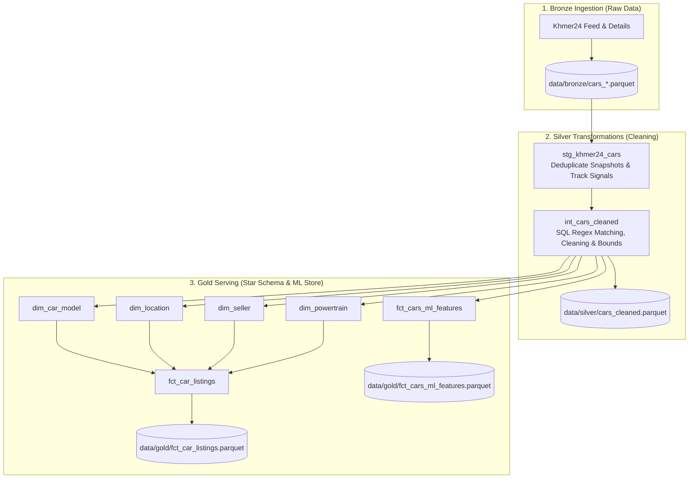

# 🛠️ dbt Transformation Playbook for Used Car Price Prediction

> **Project**: Cambodia Used Car Price Prediction & Market Intelligence  
> **Engine**: **dbt (data build tool)** + **DuckDB** (Embedded High-Performance SQL Engine)  
> **Architecture**: Medallion Data Architecture (Bronze $\to$ Silver $\to$ Gold)  
> **Input**: Raw Bronze snapshots (`data/bronze/cars_*.parquet`)  
> **Output**: Gold Star Schema & ML Feature Store (`data/gold/*.parquet`)  

---

## 📑 Table of Contents
1. [What is dbt and Why Use it Here?](#1-what-is-dbt-and-why-use-it-here)
2. [End-to-End ELT Pipeline Architecture](#2-end-to-end-elt-pipeline-architecture)
3. [dbt Project Configuration](#3-dbt-project-configuration)
4. [Modular SQL Macros (`dbt/macros/`)](#4-modular-sql-macros-dbtmacros)
5. [Layer-by-Layer Medallion Models](#5-layer-by-layer-medallion-models)
   - [Bronze / Staging (`stg_khmer24_cars.sql`)](#bronze--staging-layer-modelsstagingstg_khmer24_carssql)
   - [Silver / Intermediate (`int_cars_cleaned.sql`)](#silver--intermediate-layer-modelsintermediateint_cars_cleanedsql)
   - [Gold / Marts: Star Schema & ML Store](#gold--marts-layer-modelsmarts)
6. [Data Quality Testing (51 Automated Tests)](#6-data-quality-testing-51-automated-tests)
7. [Running and Testing Commands](#7-running-and-testing-commands)

---

## 1. What is dbt and Why Use it Here?

**dbt (data build tool)** is a modern transformation framework that allows engineers to write clean, modular **`SELECT` SQL queries** to transform data inside a database.

### Key Benefits:
1. **Zero Data Loss (ELT)**: All raw data is stored as-is in the Bronze layer. All cleaning happens in SQL views and tables.
2. **Modular Reusable Macros**: Complex regex rules for brand extraction and Khmer language translation are written once in macros and reused across models.
3. **Automated Lineage (DAG)**: dbt knows the dependencies between models (`stg` $\rightarrow$ `int` $\rightarrow$ `dim`/`fct`) and runs them in the right order.
4. **Built-in Quality Contracts**: 51 automated tests check for unique IDs, valid ranges, and allowed categories before data is used for machine learning.

---

## 2. End-to-End ELT Pipeline Architecture



---

## 3. dbt Project Configuration

### Profile Configuration ([`dbt/profiles.yml`](file:///D:/ITC3_AMS_2025/I4_AMS_S2/Y4_Internship/Car_price_prediction/dbt/profiles.yml))
Connects dbt directly to an embedded DuckDB database:

```yaml
khmer24_duckdb:
  target: dev
  outputs:
    dev:
      type: duckdb
      path: data/duckdb/khmer24.duckdb
      threads: 4
      external_root: '.'
```

### Project Configuration ([`dbt/dbt_project.yml`](file:///D:/ITC3_AMS_2025/I4_AMS_S2/Y4_Internship/Car_price_prediction/dbt/dbt_project.yml))
Defines materialization strategies across the Medallion tiers:
* **Staging (Bronze)**: Materialized as `view` (always fresh, zero storage cost).
* **Intermediate (Silver)**: Materialized as `view` with post-hook export to `data/silver/cars_cleaned.parquet`.
* **Marts (Gold)**: Materialized as `table` with post-hook exports to `data/gold/*.parquet`.

---

## 4. Modular SQL Macros (`dbt/macros/`)

All complex text normalization and regex parsing are stored in modular Jinja macros:

| Macro File | Purpose | Example Usage |
| :--- | :--- | :--- |
| [`brand_model_macro.sql`](file:///D:/ITC3_AMS_2025/I4_AMS_S2/Y4_Internship/Car_price_prediction/dbt/macros/brand_model_macro.sql) | Matches brand names and canonical models from Khmer, English, and Chinese text. | `{{ extract_brand_from_raw('raw_spec_brand', 'raw_title') }}` |
| [`clean_specs_macro.sql`](file:///D:/ITC3_AMS_2025/I4_AMS_S2/Y4_Internship/Car_price_prediction/dbt/macros/clean_specs_macro.sql) | Cleans and normalizes mileage km, engine cc, fuel types (Petrol, Diesel, Hybrid, Electric, LPG), transmissions, and colors. | `{{ parse_raw_mileage('raw_spec_mileage') }}` |
| [`brand_tier_macro.sql`](file:///D:/ITC3_AMS_2025/I4_AMS_S2/Y4_Internship/Car_price_prediction/dbt/macros/brand_tier_macro.sql) | Classifies car brands into `Luxury`, `Mass_Market`, `Chinese_EV`, or `Other`. | `{{ classify_brand_tier('vehicle_brand') }}` |
| [`nlp_options_macro.sql`](file:///D:/ITC3_AMS_2025/I4_AMS_S2/Y4_Internship/Car_price_prediction/dbt/macros/nlp_options_macro.sql) | Extracts binary option signals from listing titles (`has_full_option`, `is_urgent_sale`). | `{{ extract_title_options('listing_title') }}` |

---

## 5. Layer-by-Layer Medallion Models

### Bronze / Staging Layer: `models/staging/stg_khmer24_cars.sql`
* Reads all daily Parquet files using `read_parquet('data/bronze/cars_*.parquet', union_by_name=true)`.
* Deduplicates listings using `ROW_NUMBER() OVER (PARTITION BY listing_id ORDER BY scraped_at DESC)`.
* Computes time-series metrics: `days_on_market`, `initial_price`, `price_drop_amount`, and `view_velocity`.

### Silver / Intermediate Layer: `models/intermediate/int_cars_cleaned.sql`
* Applies regex macros to parse brand, model, color, fuel type, transmission, and mileage.
* Clamps unreasonable mileage ($> 500,000\text{ km}$) and engine cc ($> 7,000\text{ cc}$) to `NULL` to preserve row volume.
* Enforces hard business filters: $\$500 \le \text{price} \le \$300,000$ and $1990 \le \text{year} \le \text{Current Year} + 1$.
* Exports conformed dataset to `data/silver/cars_cleaned.parquet`.

### Gold / Marts Layer: `models/marts/`
1. **Core Star Schema (`models/marts/core/`)**:
   * `dim_car_model.sql` $\rightarrow$ `data/gold/dim_car_model.parquet`
   * `dim_location.sql` $\rightarrow$ `data/gold/dim_location.parquet`
   * `dim_seller.sql` $\rightarrow$ `data/gold/dim_seller.parquet`
   * `dim_powertrain.sql` $\rightarrow$ `data/gold/dim_powertrain.parquet`
   * `fct_car_listings.sql` $\rightarrow$ `data/gold/fct_car_listings.parquet`
2. **ML Feature Store (`models/marts/ml/`)**:
   * `fct_cars_ml_features.sql` $\rightarrow$ `data/gold/fct_cars_ml_features.parquet` (applies hierarchical median imputations and $\ln(1 + \text{price})$ scaling).

---

## 6. Data Quality Testing (51 Automated Tests)

The project enforces **51 automated data tests** across all models:
* **Uniqueness**: `listing_id`, `model_key`, `location_key`, `seller_key`, `powertrain_key`.
* **Not-Null**: Required IDs, prices, brands, fuel types, and log target variables.
* **Accepted Values**: Fuel types (`Petrol`, `Diesel`, `Hybrid`, `Electric`, `LPG`), conditions (`new`, `used`), brand categories (`Luxury`, `Mass_Market`, `Chinese_EV`, `Other`).
* **Accepted Range**: Prices strictly within $\$500$ to $\$300,000$.

---

## 7. Running and Testing Commands

### Run transformations and build all models:
```bash
python pipeline/dbt_runner.py run
# or directly with dbt:
dbt run --project-dir dbt --profiles-dir dbt
```

### Run all 51 automated quality tests:
```bash
python pipeline/dbt_runner.py test
# or directly with dbt:
dbt test --project-dir dbt --profiles-dir dbt
```

### Run full pipeline (run + test):
```bash
python pipeline/dbt_runner.py all
```
