# 🇰🇭 Cambodia Car Price Prediction — 8-Week Engineering Roadmap

> **Role**: Data Scientist & Machine Learning Engineer Intern  
> **Institution**: Institute of Technology of Cambodia (ITC) — Department of Applied Mathematics and Statistics (AMS)  
> **Duration**: 8 Weeks  
> **Last Updated**: September 2, 2026  
> **Overall Progress**: ████████████░░░░░░░░ **60% Complete** (Phases 1, 2 & 3 Complete — Phase 4 Active)  
> **Test Suite**:    

---

## 🎯 1. Project Mission & System Overview

Build a **production-grade, fully automated, and self-updating Machine Learning system** that:

1. 🕷️ **Scrapes** vehicle market listings daily from **Khmer24.com** with Cloudflare anti-bot bypass and concurrent detail extraction.
2. 🗣️ **Standardizes** noisy multilingual listing titles (Khmer, Chinese, English, local slang) using modular SQL macros.
3. 💎 **Cleans & Models** data using a **Medallion Data Architecture (Bronze $\rightarrow$ Silver $\rightarrow$ Gold)** with **dbt** and **DuckDB**.
4. ⭐ **Structures** analytics into an enterprise **Star Schema** (`dim_car_model`, `dim_location`, `dim_seller`, `dim_powertrain`, `fct_car_listings`).
5. 🤖 **Trains & Evaluates** high-precision regression models (LightGBM, XGBoost, CatBoost) on the Gold ML Feature Store.
6. 🌐 **Serves** predictions in real time via a **FastAPI REST API** (`POST /predict`).
7. 🔄 **Automates** the continuous learning loop via **GitHub Actions** (daily scrape + dbt transformations).
8. 📱 **Presents** market insights via an **Interactive Valuation Dashboard** (Streamlit).

```mermaid
graph LR
    P1["Phase 1: Ingestion & Storage<br/>(Bronze Parquet & CSV)"] --> P2["Phase 2: NLP & Cleaning<br/>(dbt SQL Macros)"]
    P2 --> P3["Phase 3: Medallion Pipeline<br/>(Star Schema & ML Store)"]
    P3 --> P4["Phase 4: EDA & Insights<br/>(Market Exploration)"]
    P4 --> P5["Phase 5: ML Modeling<br/>(LightGBM, XGBoost, RF)"]
    P5 --> P6["Phase 6: Tuning & SHAP<br/>(Optuna + Interpretability)"]
    P6 --> P7["Phase 7: REST API<br/>(FastAPI /predict Endpoint)"]
    P7 --> P8["Phase 8: Web Dashboard<br/>(Interactive UI)"]

    style P1 fill:#d4edda,stroke:#28a745,stroke-width:2px;
    style P2 fill:#d4edda,stroke:#28a745,stroke-width:2px;
    style P3 fill:#d4edda,stroke:#28a745,stroke-width:2px;
    style P4 fill:#fff3cd,stroke:#ffc107,stroke-width:3px;
    style P5 fill:#f8f9fa,stroke:#6c757d,stroke-width:1px;
    style P6 fill:#f8f9fa,stroke:#6c757d,stroke-width:1px;
    style P7 fill:#f8f9fa,stroke:#6c757d,stroke-width:1px;
    style P8 fill:#f8f9fa,stroke:#6c757d,stroke-width:1px;
```

---

## 📅 2. Master 8-Week Timeline

| Week | Phase | Milestone / Focus | Key Deliverable | Status |
| :--- | :--- | :--- | :--- | :--- |
| **Week 1** | **Phase 1** | Ingestion & Storage | Automated scraper, Cloudflare proxy, Bronze raw Parquet files | ✅ **100% Complete** |
| **Week 2** | **Phase 2** | Multilingual SQL Macros | dbt SQL regex macros (Khmer/Chinese brand & model extraction) | ✅ **100% Complete** |
| **Week 3** | **Phase 3** | Medallion & Star Schema | dbt DuckDB models, Gold Star Schema, 51 automated quality tests | ✅ **100% Complete** |
| **Week 4** | **Phase 4** | EDA & Market Discovery | `notebooks/02_eda_exploration.ipynb`, depreciation curves | 🎯 **ACTIVE / IN PROGRESS** |
| **Week 5** | **Phase 5** | Baseline & Ensemble Modeling | `notebooks/04_model_training.ipynb`, LightGBM / XGBoost comparison | 🔲 **Next Up** |
| **Week 6** | **Phase 6** | Hyperparameter Tuning & SHAP | Optuna tuning, SHAP explainability, pricing driver analysis | 🔲 Planned |
| **Week 7** | **Phase 7** | Real-Time Serving API | `api/app.py` FastAPI REST service (`POST /predict`, `GET /health`) | 🔲 Planned |
| **Week 8** | **Phase 8** | Interactive Web Dashboard | Streamlit valuation calculator with market distribution graphs | 🔲 Planned |

---

## 📋 3. Detailed Phase Breakdown

### Phase 1: Ingestion & Raw Storage ✅ (Completed)
- Built `Khmer24Client` with `curl-cffi` TLS spoofing to bypass Cloudflare anti-bot checks.
- Implemented concurrent detail scraping (`ThreadPoolExecutor`) to fetch full specs for every car.
- Structured raw ingestion into `data/bronze/cars_YYYY-MM-DD.parquet` and `khmer24_cars.csv`.

### Phase 2: Multilingual SQL Cleaning & NLP ✅ (Completed)
- Ported all regex parsing from Python into 4 modular dbt SQL macros (`brand_model_macro.sql`, `clean_specs_macro.sql`, `brand_tier_macro.sql`, `nlp_options_macro.sql`).
- Cleaned and standardized Khmer and English vehicle colors, fuel types (including LPG), and transmissions.

### Phase 3: Medallion Lakehouse & Star Schema ✅ (Completed)
- Staged raw snapshots with deduplication and market dynamics (`days_on_market`, `price_drop_amount`, `view_velocity`).
- Built Gold Star Schema: 4 Dimension tables (`dim_car_model`, `dim_location`, `dim_seller`, `dim_powertrain`) + 1 Fact table (`fct_car_listings`).
- Built ML Feature Store table (`fct_cars_ml_features`) with hierarchical window median imputations.
- Enforced 51 automated data tests in dbt (100% passing).

### Phase 4: Exploratory Data Analysis 🔄 (Active)
- Uncover market price distributions and liquidity velocity across Cambodian provinces.
- Quantify depreciation rates across vehicle age cohorts and brand tiers.

### Phase 5: Machine Learning Modeling 🔲 (Next Up)
- Split training and testing sets with stratified sampling by brand tier.
- Train and benchmark LightGBM, XGBoost, CatBoost, and Random Forest models.
- Optimize hyperparameters using 5-fold cross-validation.
