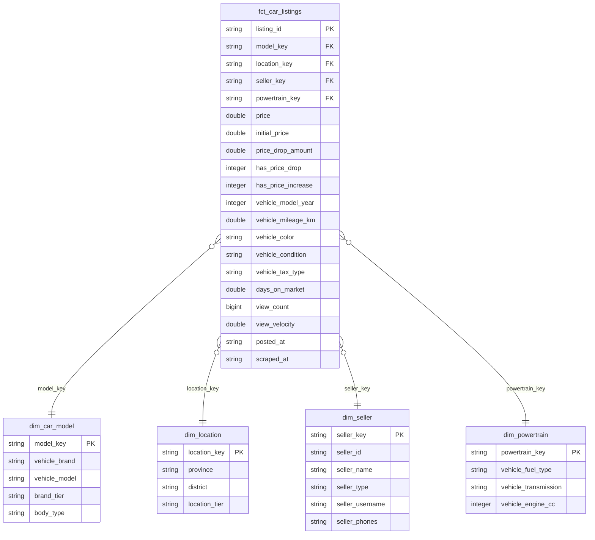

# 🌟 Star Schema Design Guide

> **Project**: Cambodia Used Car Price Prediction & Market Intelligence  
> **Layer**: Gold Layer (Analytics & Reporting)  
> **Storage**: `data/gold/*.parquet`  
> **Engine**: dbt + DuckDB  

---

## 1. What is a Star Schema?

A **Star Schema** is a simple and standard way to organize data in a warehouse. It separates your data into two types of tables:

1. **Fact Table (`fct_*`)**: Contains the core business numbers and measurements (such as prices, views, days on market).
2. **Dimension Tables (`dim_*`)**: Contain descriptive details about the business entities (such as car models, locations, sellers, and engine types).

It is called a "Star Schema" because the central Fact table connects directly to all Dimension tables like points on a star.



---

## 2. Why Use a Star Schema for This Project?

1. **Fast and Simple Queries**: Instead of writing huge queries on one messy table, analytical queries only need simple `JOIN` operations.
2. **Clean Grouping & Filtering**: You can easily group prices by brand tier (`dim_car_model`), province tier (`dim_location`), or seller type (`dim_seller`).
3. **Storage Efficiency**: Repeated text (like long model names or store details) is stored once in dimensions, while the fact table only stores numeric IDs and measurements.
4. **BI & Dashboard Ready**: Star schemas connect directly to tools like Power BI, Tableau, Metabase, or Streamlit without complex SQL data preparation.

---

## 3. The 4 Dimension Tables

### 1. `dim_car_model` (Car Make & Model)
* **File**: `data/gold/dim_car_model.parquet`
* **Grain**: One row per unique combination of **Brand**, **Model**, and **Body Type**.
* **Primary Key (`model_key`)**: `MD5(brand || '||' || model || '||' || body_type)`
* **Columns**:
  * `vehicle_brand`: Clean brand name (e.g. `Toyota`, `Lexus`, `Ford`, `BYD`).
  * `vehicle_model`: Canonical model name (e.g. `Prius`, `RX350`, `Ranger`).
  * `brand_tier`: Market segment (`Luxury`, `Mass_Market`, `Chinese_EV`, `Other`).
  * `body_type`: SUV, Sedan, Pickup, Van, Coupe, or Unknown.

### 2. `dim_location` (Geography & Regional Market)
* **File**: `data/gold/dim_location.parquet`
* **Grain**: One row per unique **Province** and **District**.
* **Primary Key (`location_key`)**: `MD5(province || '||' || district)`
* **Columns**:
  * `province`: Cambodian province name (e.g. `Phnom Penh`, `Siem Reap`, `Kandal`).
  * `district`: District / Khan name if available.
  * `location_tier`: Market liquidity group (`Tier_1` for Phnom Penh, `Tier_2` for major provinces, `Tier_3` for regional areas).

### 3. `dim_seller` (Seller Profile & Commercial Store)
* **File**: `data/gold/dim_seller.parquet`
* **Grain**: One row per unique **Seller ID**.
* **Primary Key (`seller_key`)**: `MD5(seller_id)`
* **Columns**:
  * `seller_id`: Khmer24 user identifier.
  * `seller_name`: Display name of the seller.
  * `seller_type`: `store` (car dealership/garage) vs. `individual` (private owner).
  * `seller_username`: Store handle or username.
  * `seller_phones`: Contact telephone numbers.

### 4. `dim_powertrain` (Engine & Transmission)
* **File**: `data/gold/dim_powertrain.parquet`
* **Grain**: One row per unique combination of **Fuel Type**, **Transmission**, and **Engine Size**.
* **Primary Key (`powertrain_key`)**: `MD5(fuel || '||' || transmission || '||' || engine_cc)`
* **Columns**:
  * `vehicle_fuel_type`: `Petrol`, `Diesel`, `Hybrid`, `Electric`, `LPG`, `Unknown`.
  * `vehicle_transmission`: `Automatic` vs. `Manual`.
  * `vehicle_engine_cc`: Engine displacement in cubic centimeters (e.g. `1800`, `2500`, `3500`).

---

## 4. The Central Fact Table: `fct_car_listings`

* **File**: `data/gold/fct_car_listings.parquet`
* **Grain**: **One row per unique car listing snapshot**.
* **Primary Key**: `listing_id`
* **Foreign Keys**:
  * `model_key` $\rightarrow$ links to `dim_car_model`
  * `location_key` $\rightarrow$ links to `dim_location`
  * `seller_key` $\rightarrow$ links to `dim_seller`
  * `powertrain_key` $\rightarrow$ links to `dim_powertrain`

### Key Measures (Numbers):
* `price`: Current asking price in USD.
* `initial_price`: Earliest observed price when first listed.
* `price_drop_amount`: Total price discount in USD since first posted.
* `has_price_drop`: Binary flag (1 if price dropped, 0 otherwise).
* `days_on_market`: Number of days the listing has been live.
* `view_count`: Total page views on Khmer24.
* `view_velocity`: Views per day (proxy for market demand).

---

## 5. Example SQL Queries on the Star Schema

### Example A: Average Car Price by Brand Category
```sql
SELECT 
    m.brand_tier,
    COUNT(f.listing_id)        AS total_listings,
    ROUND(AVG(f.price), 0)     AS avg_price_usd,
    ROUND(MEDIAN(f.price), 0)  AS median_price_usd
FROM read_parquet('data/gold/fct_car_listings.parquet') f
JOIN read_parquet('data/gold/dim_car_model.parquet')    m ON f.model_key = m.model_key
GROUP BY m.brand_tier
ORDER BY avg_price_usd DESC;
```

### Example B: Price Drops and Days on Market by Province Tier
```sql
SELECT 
    l.location_tier,
    COUNT(f.listing_id)                   AS active_cars,
    ROUND(AVG(f.days_on_market), 1)       AS avg_days_on_market,
    SUM(f.has_price_drop)                 AS listings_with_discount,
    ROUND(AVG(f.price_drop_amount), 0)    AS avg_discount_usd
FROM read_parquet('data/gold/fct_car_listings.parquet') f
JOIN read_parquet('data/gold/dim_location.parquet')     l ON f.location_key = l.location_key
GROUP BY l.location_tier;
```
