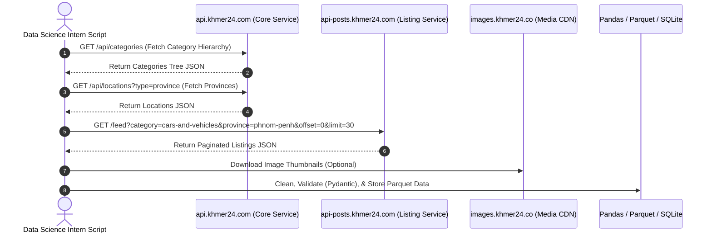
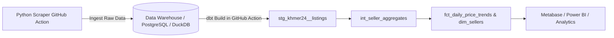

# Master Data Science Intern Playbook: Khmer24 Data Extraction, Pipeline Engineering & Market Intelligence

> **Target Audience**: Data Science Interns, Data Engineers & Analytics Practitioners
> **Prerequisites**: Python 3.10+, basic knowledge of HTTP, Pandas, Pydantic, and Data Wrangling.
> **Goal**: Build a resilient, production-grade data pipeline to extract, parse, clean, feature-engineer, and analyze e-commerce marketplace listings, price trends, and seller contact networks from Khmer24.

---

## Table of Contents

1. [Architecture &amp; Microservice Reverse Engineering](#1-architecture--microservice-reverse-engineering)
2. [JSON Schema Specifications &amp; Field Dictionary](#2-json-schema-specifications--field-dictionary)
3. [Environment &amp; Project Structure](#3-environment--project-structure)
4. [Production Python Extraction Engine](#4-production-python-extraction-engine)
5. [SSR Hydration Parser (`__NUXT_DATA__`)](#5-ssr-hydration-parser-__nuxt_data__)
6. [Data Cleaning, Feature Engineering &amp; Storage](#6-data-cleaning-feature-engineering--storage)
7. [Exploratory Data Analysis (EDA) Recipes](#7-exploratory-data-analysis-eda-recipes)
8. [Edge Cases, Resilience &amp; Ethics](#8-edge-cases-resilience--ethics)

---

## 1. Architecture & Microservice Reverse Engineering

Khmer24 does not require web browser automation (Playwright/Selenium). It utilizes a modern **Nuxt 3 (SSR + Vue 3)** frontend that communicates directly with decoupled REST microservices hosted on distinct subdomains.

### 1.1 Microservice Subdomain Map



| Microservice Host       | Base URL                             | Primary Responsibility                              | Scraper Utility                                          |
| :---------------------- | :----------------------------------- | :-------------------------------------------------- | :------------------------------------------------------- |
| **Main Core API** | `https://api.khmer24.com`          | Categories, Locations, User Profiles, Banners, Auth | **High**: Crawl category & location taxonomies     |
| **Posts API**     | `https://api-posts.khmer24.com`    | Listing Feed, Global Search, Ad Details, Saves      | **Critical**: Core data pipeline extraction source |
| **Jobs API**      | `https://api-jobs.khmer24.com`     | Job Vacancies, Candidate Resumes, Applications      | **Medium**: Job market trend scraping              |
| **AI Jobs API**   | `https://api-ai-jobs.khmer24.com`  | Automated CV extraction & match scoring             | **Low**: Internal AI service                       |
| **Chats API**     | `https://api-chats.khmer24.com`    | Buyer-Seller direct messaging                       | **N/A**: Requires authenticated user session       |
| **Comments API**  | `https://api-comments.khmer24.com` | User feedback & post comments                       | **Low**: Public sentiment analysis                 |
| **Likes API**     | `https://api-likes.khmer24.com`    | Favorite counts & post likes                        | **Medium**: Engagement analytics                   |
| **Payments API**  | `https://api-payments.khmer24.com` | ABA PayWay checkouts & subscriptions                | **N/A**: Payment processing                        |
| **Insights API**  | `https://api-insights.khmer24.com` | Ad performance metrics & store views                | **Medium**: Store analytics                        |
| **Media CDN**     | `https://images.khmer24.co`        | Image CDN (Size codes:`-b`, `-j`, `-i`)       | **High**: Image downloads & computer vision        |

---

### 1.2 HTTP Headers Reference

When sending HTTP requests, configure the following header payload:

```http
GET /feed?category=cars-and-vehicles&province=phnom-penh&offset=0&limit=30&lang=en HTTP/1.1
Host: api-posts.khmer24.com
Accept: application/json, text/json
Device-Id: ds-intern-device-f4b8c10a
display-type: desktop
Access-Token: 
User-Agent: Mozilla/5.0 (Windows NT 10.0; Win64; x64) DataScienceIntern/1.0
```

- **`Device-Id`**: Any persistent UUID or string identifier.
- **`display-type`**: Set to `desktop` (returns full field objects) or `mobile_view`.
- **`Access-Token`**: Passed when fetching authenticated user saved ads; omit or leave empty for public feeds.
- **`lang`**: Controls text language (`en` = English, `km` = Khmer, `zh` = Chinese, `ko` = Korean).

---

## 2. JSON Schema Specifications & Field Dictionary

### 2.1 Feed Listing JSON Response Schema (`GET /feed`)

Below is the exact JSON data model returned by `api-posts.khmer24.com/feed`:

```json
{
  "total": 35128,
  "limit": 30,
  "offset": 0,
  "data": [
    {
      "id": 13877263,
      "title": "2019 Mercedes-Benz G63 Brabus Bodykit Tax Paper",
      "slug": "2019-mercedes-benz-g63-brabus-bodykit-tax-paper-13877263",
      "price": "185000",
      "currency": "USD",
      "discount_price": null,
      "created_at": "2026-08-12 10:15:30",
      "renew_date": "2026-08-12 10:15:30",
      "views": 245,
      "is_saved": false,
      "category": {
        "id": 12,
        "name": "Cars for Sale",
        "slug": "cars-for-sale"
      },
      "location": {
        "province_id": 1,
        "province": "Phnom Penh",
        "province_slug": "phnom-penh",
        "district_id": 105,
        "district": "Toul Kork",
        "district_slug": "toul-kork"
      },
      "user": {
        "id": 489201,
        "name": "Auto Luxury Garage",
        "username": "auto-luxury-garage",
        "avatar": "https://images.khmer24.co/store/avatar.jpg",
        "user_type": "store"
      },
      "phone_number_1": "012345678",
      "phone_number_2": "098765432",
      "phone_number_3": null,
      "thumbnail": "https://images.khmer24.co/25-06-25/2019-mercedes-benz-g63-j.jpg",
      "images": [
        "https://images.khmer24.co/25-06-25/2019-mercedes-benz-g63-b.jpg",
        "https://images.khmer24.co/25-06-25/2019-mercedes-benz-g63-c.jpg"
      ]
    }
  ]
}
```

---

## 3. Environment & Project Structure

Organize your data science project into clean, modular code components:

```
khmer24_analytics/
├── config.py             # Settings, API base URLs, Header constants
├── schemas.py            # Pydantic data validation schemas
├── client.py             # HTTP client with rate limiting & retries
├── parsers.py            # JSON & Nuxt SSR hydration parsers
├── storage.py            # SQLite database & Parquet export functions
├── eda_analysis.py       # Data cleaning, feature engineering & EDA
└── main.py               # Main CLI driver script
```

---

## 4. Production Python Extraction Engine

### 4.1 Data Validation Schemas (`schemas.py`)

```python
from typing import List, Optional
from pydantic import BaseModel, Field, field_validator

class CategoryModel(BaseModel):
    id: Optional[int] = None
    name: str
    slug: str

class LocationModel(BaseModel):
    province: str
    province_slug: str
    district: Optional[str] = None
    district_slug: Optional[str] = None

class UserModel(BaseModel):
    id: Optional[int] = None
    name: str
    username: str
    user_type: str = "individual"

class AdListingModel(BaseModel):
    id: int
    title: str
    price: Optional[float] = None
    currency: str = "USD"
    category: Optional[str] = None
    category_slug: Optional[str] = None
    province: Optional[str] = None
    province_slug: Optional[str] = None
    district: Optional[str] = None
    seller_name: Optional[str] = None
    seller_type: Optional[str] = None
    phone_numbers: List[str] = Field(default_factory=list)
    views: int = 0
    posted_date: Optional[str] = None
    thumbnail_url: Optional[str] = None
    product_link: Optional[str] = None

    @field_validator('price', mode='before')
    def clean_price(cls, v):
        if v is None or v == "":
            return None
        if isinstance(v, (int, float)):
            return float(v)
        s = str(v).replace("$", "").replace(",", "").strip()
        try:
            return float(s)
        except ValueError:
            return None
```

### 4.2 Robust HTTP Client (`client.py`)

```python
import time
import logging
from typing import Dict, Any, List, Optional
import httpx
from schemas import AdListingModel

logging.basicConfig(level=logging.INFO, format="%(asctime)s - [%(levelname)s] - %(message)s")

class Khmer24Client:
    def __init__(self, lang: str = "en", delay: float = 0.5):
        self.lang = lang
        self.delay = delay
        self.base_headers = {
            "Accept": "application/json, text/json",
            "Device-Id": "ds-intern-device-f4b8c10a",
            "display-type": "desktop",
            "User-Agent": "Mozilla/5.0 (Windows NT 10.0; Win64; x64) Khmer24DataPipeline/2.0"
        }
        self.client = httpx.Client(timeout=20.0, headers=self.base_headers)

    def _get_with_retry(self, url: str, params: Dict[str, Any], retries: int = 3) -> Optional[httpx.Response]:
        for attempt in range(1, retries + 1):
            try:
                res = self.client.get(url, params=params)
                if res.status_code == 200:
                    return res
                elif res.status_code == 429:
                    logging.warning(f"Rate limited (429). Backing off for {attempt * 2}s...")
                    time.sleep(attempt * 2)
                else:
                    logging.error(f"HTTP {res.status_code} for {url} on attempt {attempt}")
            except httpx.RequestError as exc:
                logging.error(f"Network error on attempt {attempt}: {exc}")
                time.sleep(attempt)
        return None

    def fetch_categories(self) -> List[Dict[str, Any]]:
        url = "https://api.khmer24.com/api/categories"
        res = self._get_with_retry(url, params={"lang": self.lang, "v": 1})
        if res:
            return res.json().get("data", [])
        return []

    def fetch_locations(self, location_type: str = "province", parent: Optional[str] = None) -> List[Dict[str, Any]]:
        url = "https://api.khmer24.com/api/locations"
        params = {"lang": self.lang, "type": location_type}
        if parent:
            params["parent"] = parent
        res = self._get_with_retry(url, params=params)
        if res:
            return res.json().get("data", [])
        return []

    def scrape_category_feed(self, category_slug: str, province_slug: Optional[str] = None, max_pages: int = 10) -> List[AdListingModel]:
        url = "https://api-posts.khmer24.com/feed"
        records: List[AdListingModel] = []
        offset = 0
        limit = 30

        for page in range(1, max_pages + 1):
            params = {
                "category": category_slug,
                "offset": offset,
                "limit": limit,
                "lang": self.lang,
                "sort": "recent"
            }
            if province_slug:
                params["province"] = province_slug

            logging.info(f"Scraping category '{category_slug}' | Page {page}/{max_pages} (Offset {offset})...")
            res = self._get_with_retry(url, params=params)
            if not res:
                break

            data = res.json()
            items = data.get("data", [])
            if not items:
                logging.info("Reached end of feed.")
                break

            for item in items:
                parsed = self.parse_item(item)
                if parsed:
                    records.append(parsed)

            offset += limit
            time.sleep(self.delay)

        return records

    def parse_item(self, item: Dict[str, Any]) -> Optional[AdListingModel]:
        try:
            phones = []
            for i in range(1, 4):
                p = item.get(f"phone_number_{i}") or item.get(f"phone_{i}")
                if p and str(p).strip():
                    phones.append(str(p).strip())

            cat = item.get("category", {})
            loc = item.get("location", {})
            user = item.get("user", {})

            return AdListingModel(
                id=int(item["id"]),
                title=str(item.get("title", "")).strip(),
                price=item.get("price"),
                currency=str(item.get("currency", "USD")),
                category=cat.get("name") if isinstance(cat, dict) else cat,
                category_slug=cat.get("slug") if isinstance(cat, dict) else None,
                province=loc.get("province") if isinstance(loc, dict) else item.get("province"),
                province_slug=loc.get("province_slug") if isinstance(loc, dict) else None,
                district=loc.get("district") if isinstance(loc, dict) else item.get("district"),
                seller_name=user.get("name") if isinstance(user, dict) else item.get("username"),
                seller_type=user.get("user_type", "individual") if isinstance(user, dict) else "individual",
                phone_numbers=phones,
                views=int(item.get("views", 0)),
                posted_date=item.get("created_at") or item.get("renew_date"),
                thumbnail_url=item.get("thumbnail"),
                product_link=f"https://www.khmer24.com/{self.lang}/{item.get('slug', f'adid-{item.get(\"id\")}')}.html"
            )
        except Exception as e:
            logging.warning(f"Item parsing error for ID {item.get('id')}: {e}")
            return None
```

---

## 5. SSR Hydration Parser (`__NUXT_DATA__`)

When scraping standard HTML pages (e.g. `index.html` or direct URL links), the initial state is serialized inside a Nuxt 3 de-value array format:

```python
import re
import json

def extract_nuxt_hydration_data(html_content: str) -> Optional[dict]:
    """Extracts and parses window.__NUXT_DATA__ or inline JSON from Khmer24 HTML."""
    match = re.search(r'<script[^>]*type=["\']application/json["\'][^>]*>(.*?)</script>', html_content, re.DOTALL)
    if not match:
        return None
  
    raw_json = match.group(1)
    try:
        data = json.loads(raw_json)
        # Nuxt de-value format puts strings and data dictionaries in a indexed array
        return data
    except json.JSONDecodeError:
        return None
```

---

## 6. Data Cleaning, Feature Engineering & Storage

### 6.1 Feature Engineering Pipeline (`eda_analysis.py`)

```python
import pandas as pd
import re

def clean_and_engineer_features(df: pd.DataFrame) -> pd.DataFrame:
    df = df.copy()

    # 1. Phone Provider Feature Extraction
    def detect_telco(phones):
        if not phones or len(phones) == 0:
            return "Unknown"
        first_phone = phones[0].replace(" ", "").replace("-", "")
        if re.match(r'^(012|017|077|078|089|092|095|099)', first_phone):
            return "Cellcard"
        elif re.match(r'^(010|015|016|069|070|081|086|087|093|096|098)', first_phone):
            return "Smart"
        elif re.match(r'^(088|097|071|031)', first_phone):
            return "Metfone"
        return "Other"

    df["primary_telco"] = df["phone_numbers"].apply(detect_telco)

    # 2. Extract Vehicle Brand from Title
    brands = ["Mercedes", "Toyota", "Lexus", "BMW", "Ford", "Honda", "Mazda", "Hyundai", "Kia", "Nissan"]
    def extract_brand(title):
        for b in brands:
            if re.search(rf'\b{b}\b', title, re.IGNORECASE):
                return b
        return "Other/Unknown"

    df["vehicle_brand"] = df["title"].apply(extract_brand)

    # 3. Price Category Binning
    df["price_bin"] = pd.qcut(df["price"].dropna(), q=4, labels=["Budget", "Mid-Tier", "Premium", "Luxury"])

    return df

# Example Usage
if __name__ == "__main__":
    from client import Khmer24Client
  
    client = Khmer24Client(lang="en")
    listings = client.scrape_category_feed("cars-for-sale", province_slug="phnom-penh", max_pages=3)
  
    df_raw = pd.DataFrame([item.model_dump() for item in listings])
    df_featured = clean_and_engineer_features(df_raw)
  
    # Export to Parquet
    df_featured.to_parquet("khmer24_cars_engineered.parquet", index=False)
    print("Engineered DataFrame saved to Parquet successfully.")
```

---

## 7. Exploratory Data Analysis (EDA) Recipes

Here are ready-to-run analytics recipes for your internship assignments:

### Recipe 1: Price Summary Statistics by Vehicle Brand

```python
import pandas as pd

df = pd.read_parquet("khmer24_cars_engineered.parquet")
brand_stats = df.groupby("vehicle_brand")["price"].agg(["count", "mean", "median", "std", "min", "max"]).reset_index()
brand_stats = brand_stats.sort_values(by="count", ascending=False)
print("=== Vehicle Price Distribution by Brand ===")
print(brand_stats.to_string(index=False))
```

### Recipe 2: Active Seller Phone Contact Density

```python
# Unnest phone numbers list to rank active sellers
phones_df = df.explode("phone_numbers")
top_contacts = phones_df.groupby("phone_numbers").agg(
    seller_name=("seller_name", "first"),
    ads_count=("id", "count"),
    avg_price=("price", "mean")
).sort_values(by="ads_count", ascending=False)

print("\n=== Top Active Commercial Sellers ===")
print(top_contacts.head(10))
```

---

## 8. Edge Cases, Resilience & Ethics

> [!CAUTION]
> **Scraping Governance & Best Practices**:
>
> 1. **Polite Request Delays**: Maintain `time.sleep(0.5)` to `1.0s` between calls. Never flood the endpoints with async multi-threading without concurrency limits.
> 2. **Avoid Auth Write Endpoints**: Do not attempt automated submissions to `/login`, `/register`, or `/auth/set-phone` (these require Google reCAPTCHA v3).
> 3. **PII Protection**: Store phone numbers securely in internal data lakes. Do not publicly redistribute scraped contact databases.

---

## 9. Modern Data Stack Integration: dbt in GitHub Actions (CI/CD Workflows)

Can we use **dbt (data build tool)** in a GitHub Actions workflow? **Yes!** In modern data engineering, combining python scrapers with dbt inside GitHub Actions provides an automated **ELT (Extract, Load, Transform)** pipeline.

### 9.1 The Modern ELT Data Architecture



---

### 9.2 dbt Model Layer Examples for Khmer24

#### 1. Staging Model (`models/staging/stg_khmer24__listings.sql`)

```sql
with raw_source as (
    select * from {{ source('raw_khmer24', 'raw_listings') }}
),

cleaned as (
    select
        cast(id as integer) as listing_id,
        trim(title) as listing_title,
        cast(price as numeric(12, 2)) as price_usd,
        upper(currency) as currency_code,
        trim(category) as category_name,
        trim(province) as province_name,
        trim(seller_name) as seller_name,
        phone_numbers,
        cast(views as integer) as view_count,
        cast(posted_date as timestamp) as posted_at,
        current_timestamp as ingested_at
    from raw_source
    where id is not null
)

select * from cleaned
```

#### 2. Mart Model (`models/marts/fct_daily_price_trends.sql`)

```sql
with staging as (
    select * from {{ ref('stg_khmer24__listings') }}
)

select
    cast(posted_at as date) as listing_date,
    category_name,
    province_name,
    count(listing_id) as total_listings,
    avg(price_usd) as avg_price_usd,
    median(price_usd) as median_price_usd,
    min(price_usd) as min_price_usd,
    max(price_usd) as max_price_usd
from staging
where price_usd > 0
group by 1, 2, 3
```

---

### 9.3 Production GitHub Actions Workflow (`.github/workflows/dbt_pipeline.yml`)

Save this file in your repository under `.github/workflows/dbt_pipeline.yml` to automatically execute your dbt transformations and data quality tests on every push, pull request, or scheduled cron:

```yaml
name: dbt Analytics & Data Transformation Pipeline

on:
  push:
    branches: [ main ]
  pull_request:
    branches: [ main ]
  schedule:
    # Run daily at 01:00 UTC
    - cron: '0 1 * * *'

jobs:
  run-dbt-pipeline:
    name: Run dbt Tests & Transformations
    runs-on: ubuntu-latest

    env:
      DBT_PROFILES_DIR: ./
      DBT_HOST: ${{ secrets.DBT_HOST }}
      DBT_USER: ${{ secrets.DBT_USER }}
      DBT_PASSWORD: ${{ secrets.DBT_PASSWORD }}
      DBT_PORT: ${{ secrets.DBT_PORT }}
      DBT_DBNAME: ${{ secrets.DBT_DBNAME }}
      DBT_SCHEMA: ${{ secrets.DBT_SCHEMA }}

    steps:
      - name: Checkout Repository Code
        uses: actions/checkout@v4

      - name: Set up Python 3.10
        uses: actions/setup-python@v5
        with:
          python-version: '3.10'
          cache: 'pip'

      - name: Install dbt Core & Database Adapter
        run: |
          python -m pip install --upgrade pip
          pip install dbt-core dbt-postgres

      - name: Debug dbt Connection & Profile Config
        run: |
          dbt debug --target prod

      - name: Install dbt Package Dependencies
        run: |
          dbt deps

      - name: Run dbt Seed (Lookups & Static Taxonomy Data)
        run: |
          dbt seed --target prod

      - name: Execute dbt Build (Run Models & Execute Data Tests)
        run: |
          dbt build --target prod

      - name: Generate dbt Documentation Site
        if: github.ref == 'refs/heads/main'
        run: |
          dbt docs generate --target prod

      - name: Upload dbt Docs Artifact
        if: github.ref == 'refs/heads/main'
        uses: actions/upload-pages-artifact@v3
        with:
          path: target/
```

---

### 9.4 dbt Profiles Configuration (`profiles.yml`)

Place this file in the root of your repository (or pass via `DBT_PROFILES_DIR: ./`):

### 9.5 100% Free Tier Architecture ($0/month Cost Breakdown)

Can this whole pipeline (Scraper + Warehouse + dbt + GitHub Actions + Docs) run on a **Free GitHub Account**? **YES, 100%!**

| Component                            | Free Platform                  | Free Tier Allowance                                             | Monthly Usage Needed                | Total Cost      |
| :----------------------------------- | :----------------------------- | :-------------------------------------------------------------- | :---------------------------------- | :-------------- |
| **CI/CD Execution**            | **GitHub Actions**       | **2,000 min/mo** (Private) / **Unlimited** (Public) | ~45 - 60 minutes/month              | **$0.00** |
| **Transformation Engine**      | **dbt Core (CLI)**       | **100% Open Source & Free Forever**                       | `pip install dbt-core dbt-duckdb` | **$0.00** |
| **Embedded Data Warehouse**    | **DuckDB / MotherDuck**  | Runs in GitHub Action runner / 10GB cloud free                  | ~100MB - 2GB storage                | **$0.00** |
| **Cloud Postgres Alternative** | **Neon.tech / Supabase** | 0.5 GB serverless Postgres storage free forever                 | ~200MB database storage             | **$0.00** |
| **Docs Hosting**               | **GitHub Pages**         | 100% Free static site hosting                                   | 1 dbt docs site                     | **$0.00** |

#### Recommended Zero-Cost Setup: `dbt-duckdb` in GitHub Actions

With `dbt-duckdb`, you don't even need an external database server! DuckDB runs in-memory directly inside the free GitHub Actions Linux runner and outputs lightweight, lightning-fast `.parquet` files:

```yaml
# In .github/workflows/dbt_pipeline.yml
- name: Install dbt Core & DuckDB Adapter
  run: |
    pip install dbt-core dbt-duckdb

- name: Build dbt Models (Zero Server Cost)
  run: |
    dbt build --target dev

- name: Save DuckDB Database & Parquet Files as GitHub Artifact
  uses: actions/upload-artifact@v4
  with:
    name: khmer24-duckdb-warehouse
    path: |
      data/khmer24.duckdb
      data/*.parquet
```
